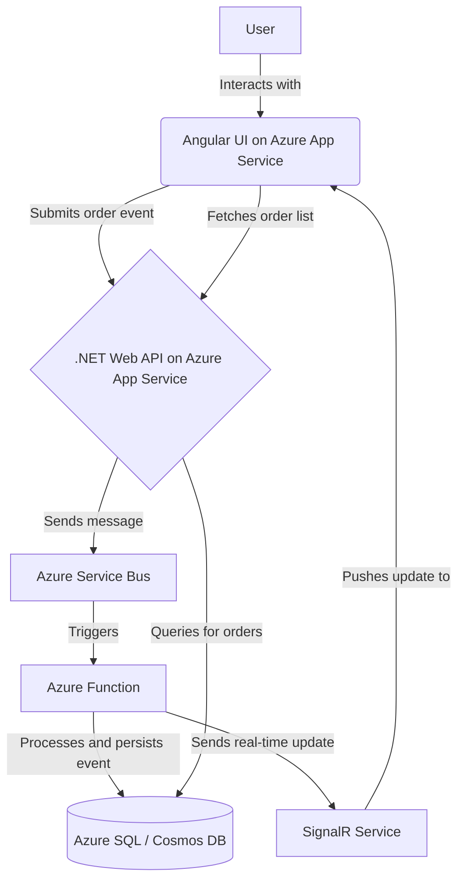
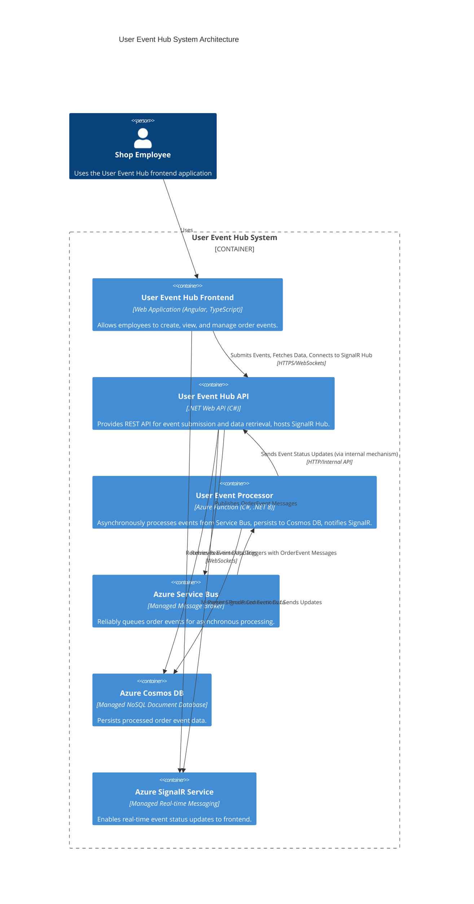
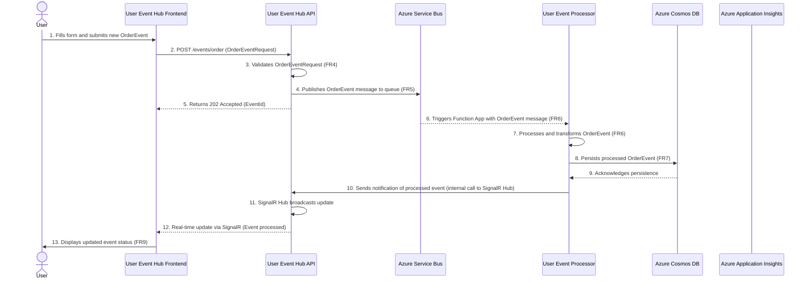

# User Event Hub Fullstack Architecture Document

## Introduction

This document outlines the complete fullstack architecture for User Event Hub, including backend systems, frontend implementation, and their integration. It serves as the single source of truth for AI-driven development, ensuring consistency across the entire technology stack.

This unified approach combines what would traditionally be separate backend and frontend architecture documents, streamlining the development process for modern fullstack applications where these concerns are increasingly intertwined.

### Starter Template or Existing Project

N/A - Greenfield project

### Change Log

| Date | Version | Description | Author |
| :--- | :------ | :---------- | :----- |

## High Level Architecture

### Technical Summary

The proposed architecture for the User Event Hub is a modern, scalable, and resilient system designed for the cloud. It features a decoupled, microservices-oriented approach that separates the frontend and backend concerns. The frontend will be a responsive Angular single-page application (SPA). The backend will be composed of a .NET Web API for receiving events and an Azure Function for asynchronous processing of those events, with Azure Service Bus acting as the intermediary message queue. This architecture directly supports the goals outlined in the PRD by providing a robust and reliable event processing pipeline. The database choice between Azure SQL and Cosmos DB will be finalized based on a deeper analysis of query patterns and scalability needs.

### Platform and Infrastructure Choice

**Platform:** Microsoft Azure
**Key Services:** Azure App Services (for API and UI), Azure Functions, Azure Service Bus, Azure Cosmos DB, Azure Monitor, and SignalR for real-time updates.
**Deployment Host and Regions:** To be determined, but will likely be a primary region with a secondary region for disaster recovery.

### Repository Structure

**Structure:** Monorepo
**Monorepo Tool:** Nx (due to its excellent support for both Angular and .NET applications within a single repository)
**Package Organization:** The monorepo will be organized into `apps` (for the Angular UI, .NET API, and Azure Function) and `libs` (for shared code, such as data models/types).

### High Level Architecture Diagram



### Architectural Patterns

-   **Serverless Computing:** Leveraging Azure Functions for event processing allows for a scalable, cost-effective, and event-driven backend. - _Rationale:_ Optimal performance and scalability for content-heavy applications
-   **Microservices Architecture:** The system is composed of small, independent services (UI, API, Function) that communicate over well-defined APIs and messages, allowing for independent development, deployment, and scaling. - _Rationale:_ Maintainability and type safety across large codebases
-   **Component-Based UI:** The Angular frontend will be built using reusable components, promoting modularity and maintainability. - _Rationale:_ Enables testing and future database migration flexibility
-   **Asynchronous Messaging:** Using Azure Service Bus to decouple the API from the processing logic enhances reliability and resilience. If the processing service is down, events are safely queued and will be processed when the service recovers. - _Rationale:_ Centralized auth, rate limiting, and monitoring
-   **API Gateway (Implicit):** The .NET Web API acts as a gateway for the frontend to interact with the backend system, providing a single entry point for event submission. - _Rationale:_ 

## Tech Stack

### Technology Stack Table

| Category | Technology | Version | Purpose | Rationale |
| :------------------ | :---------- | :------ | :-------- | :-------- |
| Frontend Language | TypeScript | 5.4 | Primary language for Angular UI | Type safety, maintainability, industry standard for Angular |
| Frontend Framework | Angular | 21.x (LTS) | Robust framework for complex SPAs | Explicitly required by NFR3 in PRD; LTS version ensures long-term support and stability |
| UI Component Library | Angular Material | 18.0 | Pre-built UI components | Consistent UI/UX, accessibility, integrates well with Angular (matched to Angular 21.x as it would be the next major version) |
| State Management | NgRx | 21.x | Reactive state management for Angular | Scalable state management, predictable state changes, large community support (aligned with Angular 21.x) |
| Node.js | Node.js | 22.x (LTS) | JS runtime for frontend build tools | LTS version provides stability for the development and build environment |
| Backend Language | C# | 12.x | Primary language for .NET Web API and Azure Function | Explicitly required by NFR4 in PRD; strong typing, performance |
| Backend Framework | .NET Web API | 8.x (LTS) | RESTful API development | Explicitly required by NFR4 in PRD; LTS version ensures long-term support and stability |
| API Style | REST | v1 | Standard for web service communication | Widely adopted, flexible, well-documented. Versioning will be via API endpoint (e.g., `/api/v1/`) |
| Database | Azure Cosmos DB | Managed by Azure | Document data persistence | Explicitly mentioned in NFR5; suitable for semi-structured event data, high write throughput, global distribution |
| Cache | Azure Cache for Redis | Managed by Azure | Distributed caching for API and Functions | Improve performance, reduce database load, supports real-time features |
| File Storage | Azure Blob Storage | Managed by Azure | Object storage for large files/assets | Scalable, cost-effective storage for non-relational data if needed |
| Authentication | Azure Active Directory B2C | Managed by Azure | User identity and access management | Enterprise-grade, secure, integrates with Azure services, supports various authentication flows |
| Frontend Testing | Jest, Angular Testing Library | Latest | Unit and integration testing for Angular components | Fast feedback, robust testing of UI logic and interactions |
| Backend Testing | xUnit | 3.2.2 | Unit and integration testing for .NET backend | Industry standard for .NET testing, compatible with .NET 8 |
| Backend Testing | Moq | 4.20.72 | Mocking framework for .NET backend unit tests | Simplifies testing of dependencies |
| E2E Testing | Cypress | 13.6 | End-to-end testing for the full application flow | Simulate user interactions, ensure complete system functionality |
| Build Tool | Angular CLI (frontend) | 21.x | Project scaffolding, building, and development tasks | Standard tooling for Angular projects (aligned with Angular 21.x) |
| Build Tool | .NET CLI (backend) | 8.x | Project scaffolding, building, and development tasks | Standard tooling for .NET projects (aligned with .NET 8) |
| Bundler | Webpack (via Angular CLI) | 5.x | Module bundling for frontend assets | Included with Angular CLI, optimizes frontend for production |
| IaC Tool | Azure Bicep | 0.40.2 | Infrastructure as Code for Azure resources | Native Azure IaC, simplifies deployment and management of Azure resources (as required by Epic 3) |
| CI/CD | Azure DevOps Pipelines | Managed by Azure | Automated build, test, and deployment workflows | Integrates seamlessly with Azure, supports monorepo builds, comprehensive CI/CD capabilities |
| Monitoring | Azure Application Insights | Managed by Azure | Application performance monitoring, logging, and diagnostics | Provides deep insights into application health and performance (as required by Epic 3) |
| Logging | Azure Monitor Logs (Log Analytics Workspace) | Managed by Azure | Centralized log collection and analysis | Collects logs from all Azure services for comprehensive observability |
| CSS Framework | Tailwind CSS | 4.1.18 | Utility-first CSS framework | Rapid UI development, highly customizable, optimizes CSS for production builds |
| Data Migration | Custom .NET/C# Scripts | N/A | Manage database schema evolution and data transformations for Azure Cosmos DB. | Ensures controlled, version-controlled changes to Cosmos DB schema and data, integrated into CI/CD. |

## Data Models

### OrderEvent

**Purpose:** Represents a single event related to user activity within the system, capturing essential details for tracking and analysis. This model serves as the single source of truth for all user-generated events.

**Key Attributes:**
-   `id`: `string` (GUID) - A unique identifier for the event.
-   `userId`: `string` - The identifier of the user who generated the event.
-   `type`: `string` - The type of event. Expected values: "PageView", "Click", "Purchase".
-   `description`: `string` - A detailed description of the event.
-   `eventPayload`: `any` (JSON) - A flexible field to store additional, event-specific details.
-   `createdAt`: `string` (ISO 8601 DateTime) - The date and time the event was created.

**TypeScript Interface:**

```typescript
type EventType = "PageView" | "Click" | "Purchase";

interface OrderEvent {
  id: string; // GUID
  userId: string;
  type: EventType;
  description: string;
  eventPayload: any; // Consider a more specific type if schema is known
  createdAt: string; // ISO 8601 DateTime
}
```

## API Specification

### REST API Specification

```yaml
openapi: 3.0.0
info:
  title: User Event Hub API
  version: 1.0.0
  description: API for managing and submitting user-generated events for the User Event Hub.
servers:
  - url: https://api.usereventhub.com/v1
    description: Production User Event Hub API server
  - url: https://dev.api.usereventhub.com/v1
    description: Development User Event Hub API server

paths:
  /events/order:
    post:
      summary: Submit a new user event
      operationId: submitOrderEvent
      requestBody:
        description: Order event object to be submitted
        required: true
        content:
          application/json:
            schema:
              $ref: '#/components/schemas/OrderEventRequest'
      responses:
        '202':
          description: Event successfully accepted for processing.
          content:
            application/json:
              schema:
                type: object
                properties:
                  message:
                    type: string
                    example: "Event accepted for processing."
                  eventId:
                    type: string
                    format: uuid
                    example: "a1b2c3d4-e5f6-7890-1234-567890abcdef"
        '400':
          description: Invalid event data provided.
          content:
            application/json:
              schema:
                type: object
                properties:
                  error:
                    type: string
                    example: "Invalid event data."
        '401':
          description: Unauthorized request.
        '403':
          description: Forbidden - Insufficient permissions.
      security:
        - azure_ad_b2c:
            - events.write

components:
  schemas:
    OrderEventRequest:
      type: object
      required:
        - userId
        - type
        - description
        - eventPayload
      properties:
        id:
          type: string
          format: uuid
          description: Unique identifier for the event. If not provided by client, will be generated by server.
          readOnly: true # Server will generate if not provided, or validate if provided.
        userId:
          type: string
          description: The identifier of the user who generated the event.
          example: "user123"
        type:
          type: string
          enum: ["PageView", "Click", "Purchase"]
          description: The type of event.
          example: "Purchase"
        description:
          type: string
          description: A detailed description of the event.
          example: "User purchased item XYZ"
        eventPayload:
          type: object
          nullable: true
          description: Additional, event-specific details in JSON format.
          example:
            productId: "P12345"
            quantity: 1
            price: 99.99
        createdAt:
          type: string
          format: date-time
          description: The date and time the event was created (ISO 8601). If not provided by client, will be generated by server.
          readOnly: true # Server will generate if not provided, or validate if provided.
    
  securitySchemes:
    azure_ad_b2c:
      type: oauth2
      description: Azure Active Directory B2C Authentication
      flows:
        implicit:
          authorizationUrl: https://login.microsoftonline.com/{tenant_id}/oauth2/v2.0/authorize
          tokenUrl: https://login.microsoftonline.com/{tenant_id}/oauth2/v2.0/token
          scopes:
            events.write: Write access to events
            events.read: Read access to events
```

## Components

### User Event Hub Frontend

**Responsibility:** Provides the user interface for shop employees to create, view, and manage user events. It handles user interaction, data presentation, and communicates with the User Event Hub API.

**Key Interfaces:**
-   **User Interface:** Web-based forms and displays for event submission and viewing.
-   **User Event Hub API:** Communicates with the backend API to submit new events and fetch event lists.
-   **SignalR Service:** Establishes a real-time connection to receive live updates on event status.

**Dependencies:**
-   User Event Hub API
-   SignalR Service
-   Azure Active Directory B2C (for authentication)

**Technology Stack:** Angular 21.x (LTS), TypeScript 5.4, Angular Material 18.0, NgRx 21.x, Tailwind CSS 4.1.18, Node.js 22.x (LTS) for development tooling.

### User Event Hub API

**Responsibility:** Provides a secure and robust API endpoint for receiving and validating user event submissions from the frontend. It acts as the gateway to the event processing pipeline, publishing validated events to the Azure Service Bus for asynchronous processing and serving event data from the database to the frontend for display. It also hosts the SignalR Hub for real-time updates.

**Key Interfaces:**
-   **REST API Endpoint (`POST /events/order`):** Receives `OrderEventRequest` from the frontend, performs validation (FR4), and publishes to Azure Service Bus (FR5).
-   **REST API Endpoint (`GET /events/order`):** Retrieves stored `OrderEvent` data from the database for listing/display on the frontend (FR8, Story 1.6).
-   **Azure Service Bus:** Publishes validated `OrderEvent` messages to a dedicated queue.
-   **Azure Cosmos DB:** Connects to the database to store and retrieve `OrderEvent` data.
-   **SignalR Hub:** Provides a real-time communication channel with the frontend for pushing event status updates (Story 2.3).

**Dependencies:**
-   User Event Hub Frontend (consumes its API and SignalR Hub)
-   Azure Service Bus (publishes messages to it)
-   Azure Cosmos DB (reads from and writes to it indirectly via processing function)
-   Azure Active Directory B2C (for authenticating API requests)
-   SignalR Service (hosts the SignalR Hub)

**Technology Stack:** .NET Web API 8.x (LTS), C# 12.x, Azure Active Directory B2C, SignalR.

### User Event Processor

**Responsibility:** Asynchronously processes `OrderEvent` messages received from the Azure Service Bus queue. It performs any necessary business logic, transformations, or enrichments on the event data, and then securely persists the processed information into the chosen database. Finally, it notifies the SignalR Hub of the event's new status for real-time frontend updates.

**Key Interfaces:**
-   **Azure Service Bus Queue Trigger:** Automatically activates upon receiving a new `OrderEvent` message from the dedicated queue.
-   **Azure Cosmos DB:** Executes database operations to write the processed `OrderEvent` data.
-   **SignalR Service Client:** Sends messages to the SignalR Hub (hosted by the User Event Hub API) to trigger real-time updates for connected clients.

**Dependencies:**
-   Azure Service Bus (receives messages from)
-   Azure Cosmos DB (writes data to)
-   SignalR Service (sends notifications to)

**Technology Stack:** Azure Function (running on .NET 8.x LTS, C# 12.x).

### Azure Service Bus

**Responsibility:** Serves as the robust, scalable, and secure message broker for the User Event Hub system. Its primary role is to reliably queue `OrderEvent` messages, decoupling the event-producing User Event Hub API from the event-consuming User Event Processor (Azure Function). This architecture ensures message delivery guarantees, supports asynchronous processing, and enhances system resilience.

**Key Interfaces:**
-   **Receives `OrderEvent` messages:** From the User Event Hub API, which publishes events to a dedicated queue.
-   **Delivers `OrderEvent` messages:** To the User Event Processor, which is triggered upon new message arrival in the queue.

**Dependencies:**
-   User Event Hub API (publishes messages to the Service Bus)
-   User Event Processor (consumes messages from the Service Bus)

**Technology Stack:** Azure Service Bus (Managed Service).

### Azure Cosmos DB

**Responsibility:** Serves as the primary, durable data store for all processed `OrderEvent` records within the User Event Hub. It ensures the reliable persistence, retrieval, and querying of event data, acting as the ultimate source of truth.

**Key Interfaces:**
-   **Receives `OrderEvent` data:** From the User Event Processor (Azure Function) for secure and persistent storage.
-   **Provides `OrderEvent` data:** To the User Event Hub API for efficient retrieval, filtering, and sorting, enabling display in the frontend.

**Dependencies:**
-   User Event Processor (writes processed event data to the database)
-   User Event Hub API (reads event data from the database)

**Technology Stack:** Azure Cosmos DB (Managed Service).

### Azure SignalR Service

**Responsibility:** Facilitates real-time, bidirectional communication between the backend (User Event Hub API, which hosts the SignalR Hub) and the connected frontend clients (User Event Hub Frontend). It enables immediate pushing of event status updates to users without requiring them to manually refresh their pages or for the frontend to constantly poll the API.

**Key Interfaces:**
-   **Receives notifications/messages:** From the User Event Processor (after an event has been processed and persisted) and forwards these to the SignalR Hub.
-   **Delivers real-time updates:** To all connected User Event Hub Frontend instances or specific clients/groups, informing them of new or updated `OrderEvent` statuses.

**Dependencies:**
-   User Event Hub API (hosts the SignalR Hub and manages client connections)
-   User Event Processor (sends event update notifications to the API's SignalR Hub)
-   User Event Hub Frontend (establishes and maintains a persistent connection to the SignalR Hub)

**Technology Stack:** Azure SignalR Service (Managed Service).

### Component Diagrams



## External APIs

N/A - No external API integrations currently required.

## Core Workflows

### Core Workflows



## Database Schema

### Azure Cosmos DB Schema for OrderEvent

For the `OrderEvent` data model, we will use an Azure Cosmos DB container (which is analogous to a collection in other NoSQL databases).

**Container Name:** `OrderEvents`

**Partition Key:** `/userId`
*   **Rationale:** Partitioning by `userId` will optimize queries that retrieve events for a specific user, which is a common access pattern (e.g., displaying an order history for a particular shop employee). This aligns with FR8 and FR9.

**Indexing Policy:** Default (automatic indexing for all properties). Custom indexing will be applied as needed to optimize specific query patterns, especially for `type` and `createdAt` for filtering and sorting.

**Example OrderEvent Document Structure:**

```json
{
  "id": "a1b2c3d4-e5f6-7890-1234-567890abcdef",
  "userId": "user123",
  "type": "Purchase",
  "description": "User purchased item XYZ from location A",
  "eventPayload": {
    "productId": "P12345",
    "quantity": 1,
    "price": 99.99,
    "locationId": "LOC001"
  },
  "createdAt": "2026-01-30T14:30:00Z",
  // Cosmos DB internal properties (e.g., _ts, _rid, _self, _etag) are automatically added
}
```

## Frontend Architecture

### Component Architecture

#### Component Organization

```text
src/
├── app/
│   ├── app-routing.module.ts
│   ├── app.component.html
│   ├── app.component.scss
│   ├── app.component.ts
│   ├── app.module.ts
│   └── core/                 # Singleton services, authentication, error handling
│       ├── guards/
│       ├── interceptors/
│       └── services/
│   ├── features/             # Feature modules (e.g., event-management, user-profile)
│   │   ├── event-management/
│   │   │   ├── components/   # Presentational components specific to this feature
│   │   │   ├── containers/   # Smart/stateful components, interact with NgRx
│   │   │   ├── services/     # Feature-specific services
│   │   │   ├── event-management-routing.module.ts
│   │   │   └── event-management.module.ts
│   │   └── user-profile/
│   │       └── ...
│   ├── shared/               # Reusable components, directives, pipes, modules
│   │   ├── components/       # Common UI elements (e.g., button, dialog, spinner)
│   │   ├── directives/
│   │   ├── pipes/
│   │   └── shared.module.ts
│   └── state/                # Global NgRx store structure (actions, reducers, effects, selectors)
│       └── ...
├── assets/                   # Static assets (images, icons)
├── environments/             # Environment-specific configurations
├── styles/                   # Global styles, variables, Tailwind CSS base
└── main.ts                   # Application entry point
```

#### Component Template

```typescript
import { ChangeDetectionStrategy, Component, Input, Output, EventEmitter } from '@angular/core';
import { CommonModule } from '@angular/common'; // Required for common directives like ngIf, ngFor

/**
 * Reusable Card component for displaying various types of content.
 *
 * Usage:
 * <app-card [title]="'Card Title'" [subtitle]="'Card Subtitle'" (cardClick)="onCardClicked($event)">
 *   <p>Card content goes here.</p>
 * </app-card>
 */
@Component({
  selector: 'app-card',
  standalone: true, // Use standalone components where possible for better modularity
  imports: [CommonModule],
  template: `
    <div class="card bg-white shadow-md rounded-lg p-6 mb-4" (click)="onCardClick()">
      <h3 *ngIf="title" class="text-xl font-semibold mb-1">{{ title }}</h3>
      <h4 *ngIf="subtitle" class="text-gray-600 text-sm mb-3">{{ subtitle }}</h4>
      <div class="card-content">
        <ng-content></ng-content>
      </div>
      <button *ngIf="showAction" (click)="onActionClick($event)" class="mt-4 px-4 py-2 bg-blue-500 text-white rounded hover:bg-blue-600">
        {{ actionLabel }}
      </button>
    </div>
  `,
  styles: [`
    .card {
      cursor: pointer;
      transition: transform 0.2s ease-in-out;
    }
    .card:hover {
      transform: translateY(-2px);
    }
  `],
  changeDetection: ChangeDetectionStrategy.OnPush, // Optimize change detection
})
export class CardComponent {
  @Input() title?: string;
  @Input() subtitle?: string;
  @Input() showAction: boolean = false;
  @Input() actionLabel: string = 'Action';

  @Output() cardClick = new EventEmitter<void>();
  @Output() actionClick = new EventEmitter<MouseEvent>();

  onCardClick(): void {
    this.cardClick.emit();
  }

  onActionClick(event: MouseEvent): void {
    event.stopPropagation(); // Prevent cardClick from firing
    this.actionClick.emit(event);
  }
}
```

### State Management Architecture

#### State Structure

```typescript
// src/app/state/app.state.ts
import { OrderEventsState } from '../features/event-management/state/order-events.reducer';

/**
 * Interface for the entire application state.
 * Each feature module will contribute its own slice of state.
 */
export interface AppState {
  orderEvents: OrderEventsState;
  // Other feature states can be added here
  // users: UsersState;
  // settings: SettingsState;
}

// src/app/features/event-management/state/order-events.reducer.ts (conceptual)
// This would be within the feature module itself.

import { OrderEvent } from '@shared/types'; // Assuming shared types package

/**
 * Interface for the OrderEvents feature state.
 */
export interface OrderEventsState {
  events: OrderEvent[]; // Array of order events
  selectedEventId: string | null; // ID of the currently selected event
  loading: boolean; // Flag to indicate if events are being loaded
  error: any | null; // Error object if an operation fails
  filter: {
    type: string | null;
    status: string | null;
    searchTerm: string | null;
  };
  sort: {
    field: 'createdAt' | 'type' | 'status';
    direction: 'asc' | 'desc';
  };
  pagination: {
    pageIndex: number;
    pageSize: number;
    totalCount: number;
  };
}
```

#### State Management Patterns

-   **Feature-centric State:** Each major application feature (e.g., `OrderEvents`, `Auth`) will own its slice of the global state, promoting modularity and encapsulation. This helps keep the codebase organized and easier to scale.
-   **Actions as Events:** All changes to the application state must be initiated by dispatching an Action. Actions are plain objects that describe unique events that occurred in the application, ensuring a clear and traceable audit log of state changes.
-   **Pure Reducers:** Reducers are pure functions that take the current state and an action, and return a *new* state. They must not mutate the original state directly and should be free of side effects, making state changes predictable and testable.
-   **Effects for Side Effects:** All asynchronous operations (like API calls to the User Event Hub API, or interactions with the SignalR Service) and other side effects will be handled by NgRx Effects. Effects listen for dispatched actions, perform operations, and then dispatch new actions to update the state, maintaining a clear separation of concerns.
-   **Selectors for State Access:** Components will access state slices using NgRx Selectors. Selectors are pure functions that derive pieces of state from the store, allowing for efficient, memoized access to data and preventing components from having direct knowledge of the state's internal structure.
-   **One-Way Data Flow:** The overall architecture will adhere to a strict one-way data flow: UI Dispatches Action -> Effects handle side effects -> Reducers update State -> Selectors project State to UI. This pattern simplifies debugging and makes the application's behavior more predictable.

### Routing Architecture

#### Route Organization

```text
src/app/
├── app-routing.module.ts       # Root routing module
├── core/
│   └── auth/
│       └── auth-routing.module.ts # Auth related routes (login, logout, callback)
├── features/
│   ├── event-management/
│   │   └── event-management-routing.module.ts # Feature-specific routes (list, detail, create)
│   ├── dashboard/
│   │   └── dashboard-routing.module.ts # Dashboard routes
│   └── user-profile/
│       └── user-profile-routing.module.ts # User profile routes
├── shared/
│   └── shared-routing.module.ts # Routes for shared components if any (rarely used)
└── pages/                      # Top-level pages (e.g., home, about, 404)
    ├── home/
    │   └── home-routing.module.ts
    └── not-found/
        └── not-found-routing.module.ts
```

#### Protected Route Pattern

```typescript
// src/app/core/guards/auth.guard.ts
import { Injectable } from '@angular/core';
import { CanActivate, ActivatedRouteSnapshot, RouterStateSnapshot, UrlTree, Router } from '@angular/router';
import { Observable, of } from 'rxjs';
import { switchMap, take, tap, catchError } from 'rxjs/operators';
import { AuthService } from '../services/auth.service'; // Our custom auth service
import { Store } from '@ngrx/store';
import { selectIsAuthenticated } from '../state/auth.selectors'; // NgRx selector for auth state
import * as AuthActions from '../state/auth.actions';

@Injectable({
  providedIn: 'root'
})
export class AuthGuard implements CanActivate {
  constructor(
    private authService: AuthService,
    private router: Router,
    private store: Store
  ) {}

  canActivate(
    route: ActivatedRouteSnapshot,
    state: RouterStateSnapshot
  ): Observable<boolean | UrlTree> | Promise<boolean | UrlTree> | boolean | UrlTree {
    return this.store.select(selectIsAuthenticated).pipe(
      take(1), // Take the first value and complete
      switchMap(isAuthenticated => {
        if (isAuthenticated) {
          // User is authenticated, allow access
          return of(true);
        }
        else {
          // User is not authenticated, try to acquire token silently or redirect to login
          return this.authService.acquireTokenSilent().pipe(
            switchMap(success => {
              if (success) {
                // Successfully acquired token silently, user is now authenticated
                this.store.dispatch(AuthActions.loginSuccess()); // Update NgRx state
                return of(true);
              }
              else {
                // Cannot acquire token silently, redirect to login page
                this.router.navigate(['/login'], { queryParams: { returnUrl: state.url } });
                return of(false);
              }
            }),
            catchError(err => {
              // Handle any errors during silent token acquisition (e.g., user needs to log in interactively)
              console.error('Silent token acquisition failed:', err);
              this.router.navigate(['/login'], { queryParams: { returnUrl: state.url } });
              return of(false);
            })
          );
        }
      })
    );
  }
}
```

### Frontend Services Layer

#### API Client Setup

```typescript
// src/app/core/services/api-client.service.ts
import { Injectable } from '@angular/core';
import { HttpClient, HttpHeaders } from '@angular/common/http';
import { Observable } from 'rxjs';
import { environment } from '../../../environments/environment';

/**
 * Generic API client service for interacting with the backend.
 * All API calls should go through this service or services built upon it.
 */
@Injectable({
  providedIn: 'root'
})
export class ApiClientService {
  private readonly apiUrl = environment.apiUrl;

  constructor(private http: HttpClient) {}

  private getHeaders(contentType: string = 'application/json'): HttpHeaders {
    return new HttpHeaders({
      'Content-Type': contentType,
      // Authorization header will be added by AuthInterceptor
    });
  }

  get<T>(path: string, options?: { headers?: HttpHeaders, params?: any }): Observable<T> {
    return this.http.get<T>(`${this.apiUrl}/${path}`, { headers: options?.headers || this.getHeaders(), params: options?.params });
  }

  post<T>(path: string, body: any, options?: { headers?: HttpHeaders }): Observable<T> {
    return this.http.post<T>(`${this.apiUrl}/${path}`, body, { headers: options?.headers || this.getHeaders() });
  }

  put<T>(path: string, body: any, options?: { headers?: HttpHeaders }): Observable<T> {
    return this.http.put<T>(`${this.apiUrl}/${path}`, body, { headers: options?.headers || this.getHeaders() });
  }

  delete<T>(path: string, options?: { headers?: HttpHeaders }): Observable<T> {
    return this.http.delete<T>(`${this.apiUrl}/${path}`, { headers: options?.headers || this.getHeaders() });
  }

  // ... other HTTP methods as needed
}

// src/app/core/interceptors/auth.interceptor.ts
import { Injectable } from '@angular/core';
import {
  HttpRequest,
  HttpHandler,
  HttpEvent,
  HttpInterceptor
} from '@angular/common/http';
import { Observable, from } from 'rxjs';
import { switchMap } from 'rxjs/operators';
import { AuthService } from '../services/auth.service'; // Our custom auth service

/**
 * Interceptor to automatically attach authentication tokens to API requests.
 */
@Injectable()
export class AuthInterceptor implements HttpInterceptor {

  constructor(private authService: AuthService) {}

  intercept(request: HttpRequest<any>, next: HttpHandler): Observable<HttpEvent<any>> {
    // Only intercept calls to our backend API
    if (request.url.startsWith(environment.apiUrl)) {
      return from(this.authService.getAccessToken()).pipe( // getAccessToken returns a Promise
        switchMap(token => {
          if (token) {
            const authRequest = request.clone({
              setHeaders: {
                Authorization: `Bearer ${token}`
              }
            });
            return next.handle(authRequest);
          }
          return next.handle(request); // No token available, proceed with original request
        })
      );
    }
    return next.handle(request); // Not our API, skip interception
  }
}

// src/app/app.module.ts (or core.module.ts if using modules)
import { HTTP_INTERCEPTORS } from '@angular/common/http';
import { AuthInterceptor } from './core/interceptors/auth.interceptor';

// ...
providers: [
  {
    provide: HTTP_INTERCEPTORS,
    useClass: AuthInterceptor,
    multi: true // Important: allows multiple interceptors
  }
],
// ...
```

#### Service Example

```typescript
// src/app/features/event-management/services/order-events-api.service.ts
import { Injectable } from '@angular/core';
import { ApiClientService } from '../../core/services/api-client.service';
import { Observable } from 'rxjs';
import { OrderEvent, EventType } from '@shared/types'; // Assuming shared types package
import { Store } from '@ngrx/store';
import { AppState } from '../../state/app.state';
import * as OrderEventsActions from '../state/order-events.actions';
import { tap } from 'rxjs/operators';

/**
 * Service responsible for making API calls related to Order Events.
 * It uses the generic ApiClientService and dispatches NgRx actions.
 */
@Injectable({
  providedIn: 'root'
})
export class OrderEventsApiService {
  private readonly baseUrl = 'events/order'; // Path relative to environment.apiUrl

  constructor(
    private apiClient: ApiClientService,
    private store: Store<AppState>
  ) {}

  /**
   * Submits a new OrderEvent to the backend.
   * Dispatches NgRx actions for loading state and success/failure.
   * @param event The OrderEvent to submit.
   * @returns An Observable of the API response.
   */
  submitOrderEvent(event: Omit<OrderEvent, 'id' | 'createdAt' | 'status'>): Observable<{ message: string; eventId: string }> {
    this.store.dispatch(OrderEventsActions.submitOrderEvent()); // Indicate loading state
    return this.apiClient.post<{ message: string; eventId: string }>(this.baseUrl, event).pipe(
      tap(
        response => this.store.dispatch(OrderEventsActions.submitOrderEventSuccess({ eventId: response.eventId })),
        error => this.store.dispatch(OrderEventsActions.submitOrderEventFailure({ error }))
      )
    );
  }

  /**
   * Fetches a list of Order Events from the backend.
   * Dispatches NgRx actions for loading state and success/failure.
   * @param filterParams Optional filter, sort, and pagination parameters.
   * @returns An Observable of an array of OrderEvent.
   */
  getLatestOrderEvents(
    filterParams?: { type?: EventType; status?: string; search?: string; pageIndex?: number; pageSize?: number; sortBy?: string; sortDirection?: 'asc' | 'desc' }
  ): Observable<OrderEvent[]> {
    this.store.dispatch(OrderEventsActions.loadOrderEvents()); // Indicate loading state
    return this.apiClient.get<OrderEvent[]>(this.baseUrl, { params: filterParams }).pipe(
      tap(
        events => this.store.dispatch(OrderEventsActions.loadOrderEventsSuccess({ events })),
        error => this.store.dispatch(OrderEventsActions.loadOrderEventsFailure({ error }))
      )
    );
  }

  // Example of how the SignalR real-time updates might be handled (conceptual) 
  // This would typically be in an NgRx Effect or a dedicated real-time service.
  /*
  listenForRealtimeUpdates(): void {
    this.signalRService.onEventUpdate().subscribe(event => {
      this.store.dispatch(OrderEventsActions.updateOrderEvent({ event }));
    });
  }
  */
}
```

## Backend Architecture

### Service Architecture

#### Controller/Route Organization (for .NET Web API)

```text
src/
├── UserEventHub.Api/
│   ├── Controllers/             # API Controllers (e.g., EventsController)
│   ├── Services/                # Business logic services (e.g., EventSubmissionService)
│   ├── Repositories/            # Data access layer (e.g., CosmosDbRepository)
│   ├── Models/                  # API request/response models (e.g., OrderEventRequest)
│   ├── Extensions/              # Extension methods
│   ├── Filters/                 # Custom action/resource filters (e.g., ValidationFilter)
│   ├── Middlewares/             # Custom middleware
│   ├── Data/                    # DbContext or other data-related classes
│   ├── HealthChecks/            # Health check definitions
│   ├── Program.cs               # Entry point
│   ├── Startup.cs               # Configuration (if not using Minimal APIs)
│   └── appsettings.json
```

#### Controller Template (for .NET Web API)

```csharp
// src/UserEventHub.Api/Controllers/EventsController.cs
using System;
using System.Threading.Tasks;
using Microsoft.AspNetCore.Authorization;
using Microsoft.AspNetCore.Mvc;
using Microsoft.Extensions.Logging;
using UserEventHub.Api.Models; // DTOs for request/response
using UserEventHub.Api.Services; // Business logic services
using UserEventHub.Shared.Models; // Shared domain models (e.g., OrderEvent)

namespace UserEventHub.Api.Controllers
{
    [ApiController]
    [Route("api/v1/[controller]")] // api/v1/Events
    [Authorize] // Requires authentication for all actions in this controller
    public class EventsController : ControllerBase
    {
        private readonly IEventSubmissionService _eventSubmissionService;
        private readonly IEventQueryService _eventQueryService; // Service for retrieving events
        private readonly ILogger<EventsController> _logger;

        public EventsController(
            IEventSubmissionService eventSubmissionService,
            IEventQueryService eventQueryService,
            ILogger<EventsController> logger)
        {
            _eventSubmissionService = eventSubmissionService ?? throw new ArgumentNullException(nameof(eventSubmissionService));
            _eventQueryService = eventQueryService ?? throw new ArgumentNullException(nameof(eventQueryService));
            _logger = logger ?? throw new ArgumentNullException(nameof(logger));
        }

        /// <summary>
        /// Submits a new user event to the system for asynchronous processing.
        /// </summary>
        /// <param name="request">The event details.</param>
        /// <returns>A 202 Accepted response with the generated event ID.</returns>
        [HttpPost("order")] // api/v1/Events/order
        [Authorize(Policy = "Events.Write")] // Requires specific authorization policy
        [ProducesResponseType(typeof(EventSubmissionResponse), StatusCodes.Status202Accepted)]
        [ProducesResponseType(StatusCodes.Status400BadRequest)]
        [ProducesResponseType(StatusCodes.Status401Unauthorized)]
        [ProducesResponseType(StatusCodes.Status403Forbidden)]
        public async Task<IActionResult> SubmitOrderEvent([FromBody] OrderEventRequest request)
        {
            _logger.LogInformation("Received request to submit OrderEvent for UserId: {UserId}", request.UserId);

            // Model validation is automatically handled by ASP.NET Core's [ApiController] attribute
            // Any further business-level validation should occur in the service layer.

            try
            {
                // In a real scenario, the service would map the DTO to a domain model
                // and handle business logic before publishing to the message broker.
                var eventId = await _eventSubmissionService.SubmitOrderEventAsync(request);

                _logger.LogInformation("OrderEvent submitted successfully with ID: {EventId}", eventId);
                return Accepted(new EventSubmissionResponse { EventId = eventId, Message = "Event accepted for processing." });
            }
            catch (ValidationException ex) // Custom exception for business validation errors
            {
                _logger.LogWarning(ex, "Validation error submitting OrderEvent: {Message}", ex.Message);
                return BadRequest(new { error = ex.Message });
            }
            catch (Exception ex)
            {
                _logger.LogError(ex, "An unexpected error occurred while submitting OrderEvent.");
                return StatusCode(StatusCodes.Status500InternalServerError, new { error = "An internal server error occurred." });
            }
        }

        /// <summary>
        /// Retrieves a paginated and filterable list of order events.
        /// </summary>
        /// <param name="filter">Filter parameters (e.g., type, status, search term).</param>
        /// <returns>A list of order events.</returns>
        [HttpGet("order")] // api/v1/Events/order
        [Authorize(Policy = "Events.Read")] // Requires specific authorization policy
        [ProducesResponseType(typeof(IEnumerable<OrderEvent>), StatusCodes.Status200OK)]
        [ProducesResponseType(StatusCodes.Status401Unauthorized)]
        [ProducesResponseType(StatusCodes.Status403Forbidden)]
        public async Task<IActionResult> GetOrderEvents([FromQuery] EventFilterParameters filter)
        {
            _logger.LogInformation("Received request to get OrderEvents with filter: {@Filter}", filter);

            try
            {
                var events = await _eventQueryService.GetFilteredEventsAsync(filter);
                return Ok(events);
            }
            catch (Exception ex)
            {
                _logger.LogError(ex, "An unexpected error occurred while getting OrderEvents.");
                return StatusCode(StatusCodes.Status500InternalServerError, new { error = "An internal server error occurred." });
            }
        }

        // Additional actions for other event-related operations could be added here
    }
}
```

#### Function Organization (for Azure Function App)

```text
src/
├── UserEventHub.Processor/
│   ├── UserEventProcessor.cs        # The Azure Function class (e.g., ServiceBusTrigger)
│   ├── Services/                    # Business logic services (e.g., EventProcessingService)
│   ├── Repositories/                # Data access layer (e.g., CosmosDbRepository for writing)
│   ├── Models/                      # DTOs, domain models (e.g., OrderEvent)
│   ├── Extensions/                  # Extension methods (e.g., for dependency injection)
│   ├── Host.cs                      # Program entry point for DI, configuration (if .NET Isolated)
│   ├── local.settings.json          # Local environment settings
│   ├── appsettings.json             # Application settings for deployment
│   ├── host.json                    # Azure Functions host configuration
│   └── function.json                # Function specific configuration (for in-process model)
```

#### Function Template

```csharp
// src/UserEventHub.Processor/UserEventProcessor.cs
using System;
using System.Threading.Tasks;
using Azure.Messaging.ServiceBus;
using Microsoft.Azure.Functions.Worker;
using Microsoft.Extensions.Logging;
using Newtonsoft.Json; // For deserialization, consider System.Text.Json
using UserEventHub.Processor.Models; // Assuming models for deserialization
using UserEventHub.Processor.Services; // Event processing business logic
using UserEventHub.Shared.Models; // Shared domain models (e.g., OrderEvent)

namespace UserEventHub.Processor
{
    public class UserEventProcessor
    {
        private readonly IEventProcessingService _eventProcessingService;
        private readonly ILogger<UserEventProcessor> _logger;

        public UserEventProcessor(IEventProcessingService eventProcessingService, ILogger<UserEventProcessor> logger)
        {
            _eventProcessingService = eventProcessingService ?? throw new ArgumentNullException(nameof(eventProcessingService));
            _logger = logger ?? throw new ArgumentNullException(nameof(logger));
        }

        [Function("ProcessOrderEvent")]
        public async Task Run(
            [ServiceBusTrigger("order-events", Connection = "ServiceBusConnection")] ServiceBusReceivedMessage message,
            FunctionContext context)
        {
            _logger.LogInformation($"C# ServiceBus queue trigger function processed message: {message.MessageId}");

            try
            {
                // Deserialize the message body into our shared OrderEvent model
                var orderEvent = JsonConvert.DeserializeObject<OrderEvent>(message.Body.ToString());

                if (orderEvent == null)
                {
                    _logger.LogError($"Could not deserialize message {message.MessageId} to OrderEvent. Message Body: {message.Body}");
                    // Optionally Dead-Letter the message or handle as appropriate for malformed messages
                    throw new InvalidOperationException($"Malformed OrderEvent message received: {message.MessageId}");
                }

                _logger.LogInformation($"Processing OrderEvent of type '{orderEvent.Type}' for UserId: '{orderEvent.UserId}', EventId: '{orderEvent.Id}'");

                // Delegate business logic to a separate service
                await _eventProcessingService.ProcessAndPersistEventAsync(orderEvent);

                _logger.LogInformation($"Successfully processed OrderEvent {orderEvent.Id}");
            }
            catch (Exception ex)
            {
## Development Workflow

Define the development setup and workflow for the fullstack application.

### Local Development Setup

#### Prerequisites

```bash
# Install Node.js (v22.x LTS)
# Install .NET SDK (v8.x LTS)
# Install Nx CLI globally: npm install -g nx
# Install Docker (if using local Cosmos DB emulator or other containerized services)
```

#### Initial Setup

```bash
# Clone the repository
git clone <your-repository-url>
cd <your-repository-name>

# Install npm dependencies for the monorepo
npm install

# Restore Nx cache (optional, if using distributed caching)
nx restore
```

#### Development Commands

```bash
# Start all services (frontend and backend)
# This assumes your nx.json configures 'serve' for both apps
nx run-many --target=serve --all # Or a custom script like `npm run dev`

# Start frontend only
nx serve web

# Start backend only
nx serve api

# Run all tests
nx run-many --target=test --all
# Or for specific projects:
# nx test web
# nx test api
```

### Environment Configuration

#### Required Environment Variables

```bash
# Frontend (.env.local)
# Example:
# NX_PUBLIC_API_URL=http://localhost:3000/api/v1
# NX_PUBLIC_AZURE_AD_B2C_CLIENT_ID=...
# NX_PUBLIC_AZURE_AD_B2C_TENANT_ID=...

# Backend (.env)
# Example:
# ASSET_CORS_ORIGINS=http://localhost:4200
# ConnectionStrings__CosmosDbConnection=...
# ServiceBusConnection=...
# AzureAdB2C__Instance=...
# AzureAdB2C__ClientId=...
# AzureAdB2C__Domain=...

# Shared
# Environment variables that might be shared or used in CI/CD, but not directly in local .env files
# Example:
# AZURE_STORAGE_CONNECTION_STRING=...
# AZURE_TENANT_ID=...
# AZURE_SUBSCRIPTION_ID=...
```

## Unified Project Structure

Create a monorepo structure that accommodates both frontend and backend. Adapt based on chosen tools and frameworks.

```plaintext
User Event Hub/
├── .github/                    # CI/CD workflows
│   └── workflows/
│       ├── ci.yaml
│       └── deploy.yaml
├── apps/                       # Application packages
│   ├── web/                    # Frontend application
│   │   ├── src/
│   │   │   ├── components/     # UI components
│   │   │   ├── pages/          # Page components/routes
│   │   │   ├── hooks/          # Custom React hooks
│   │   │   ├── services/       # API client services
│   │   │   ├── stores/         # State management
│   │   │   ├── styles/         # Global styles/themes
│   │   │   └── utils/          # Frontend utilities
│   │   ├── public/             # Static assets
│   │   ├── tests/              # Frontend tests
│   │   └── package.json
│   └── api/                    # Backend application
│       ├── src/
│       │   ├── routes/         # API routes/controllers
│       │   ├── services/       # Business logic
│       │   ├── models/         # Data models
│       │   ├── middleware/     # Express/API middleware
│       │   ├── utils/          # Backend utilities
│       │   └── Program.cs
│       ├── tests/              # Backend tests
│       └── package.json
├── packages/                   # Shared packages
│   ├── shared/                 # Shared types/utilities
│   │   ├── src/
│   │   │   ├── types/          # TypeScript interfaces
│   │   │   ├── constants/      # Shared constants
│   │   │   └── utils/          # Shared utilities
│   │   └── package.json
│   ├── ui/                     # Shared UI components
│   │   ├── src/
│   │   └── package.json
│   └── config/                 # Shared configuration
│       ├── eslint/
│       ├── typescript/
│       └── jest/
├── infrastructure/             # IaC definitions
│   └── azure-bicep/
├── scripts/                    # Build/deploy scripts
├── docs/                       # Documentation
│   ├── prd.md
│   ├── front-end-spec.md
│   └── fullstack-architecture.md
├── .env.example                # Environment template
├── package.json                # Root package.json
├── nx.json                     # Monorepo configuration
└── README.md