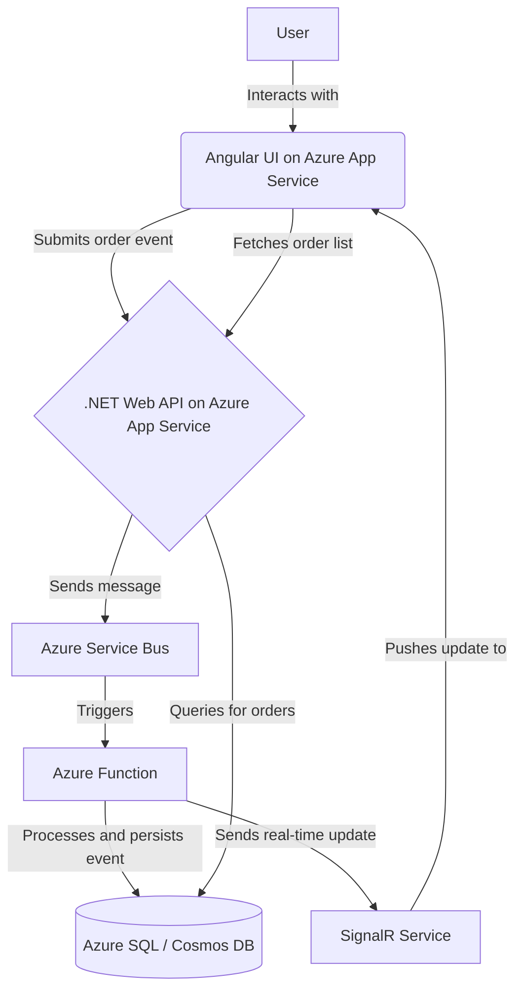
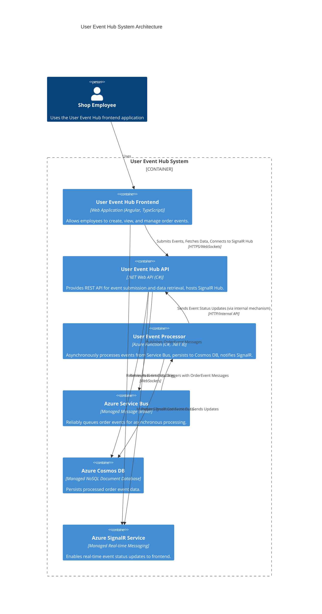
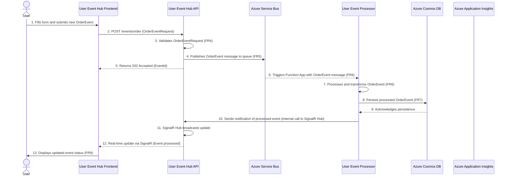

# User Event Hub Fullstack Architecture Document

## Introduction

This document outlines the complete fullstack architecture for User Event Hub, including backend systems, frontend implementation, and their integration. It serves as the single source of truth for AI-driven development, ensuring consistency across the entire technology stack.

This unified approach combines what would traditionally be separate backend and frontend architecture documents, streamlining the development process for modern fullstack applications where these concerns are increasingly intertwined.

### Starter Template or Existing Project

N/A - Greenfield project

### Change Log

| Date | Version | Description | Author |
| :--- | :------ | :---------- | :----- |

## High Level Architecture

### Technical Summary

The proposed architecture for the User Event Hub is a modern, scalable, and resilient system designed for the cloud. It features a decoupled, microservices-oriented approach that separates the frontend and backend concerns. The frontend will be a responsive Angular single-page application (SPA). The backend will be composed of a .NET Web API for receiving events and an Azure Function for asynchronous processing of those events, with Azure Service Bus acting as the intermediary message queue. This architecture directly supports the goals outlined in the PRD by providing a robust and reliable event processing pipeline. The database choice between Azure SQL and Cosmos DB will be finalized based on a deeper analysis of query patterns and scalability needs.

### Platform and Infrastructure Choice

**Platform:** Microsoft Azure
**Key Services:** Azure App Services (for API and UI), Azure Functions, Azure Service Bus, Azure Cosmos DB, Azure Monitor, and SignalR for real-time updates.
**Deployment Host and Regions:** To be determined, but will likely be a primary region with a secondary region for disaster recovery.

### Repository Structure

**Structure:** Monorepo
**Monorepo Tool:** Nx (due to its excellent support for both Angular and .NET applications within a single repository)
**Package Organization:** The monorepo will be organized into `apps` (for the Angular UI, .NET API, and Azure Function) and `libs` (for shared code, such as data models/types).

### High Level Architecture Diagram



### Architectural Patterns

-   **Serverless Computing:** Leveraging Azure Functions for event processing allows for a scalable, cost-effective, and event-driven backend. - _Rationale:_ Optimal performance and scalability for content-heavy applications
-   **Microservices Architecture:** The system is composed of small, independent services (UI, API, Function) that communicate over well-defined APIs and messages, allowing for independent development, deployment, and scaling. - _Rationale:_ Maintainability and type safety across large codebases
-   **Component-Based UI:** The Angular frontend will be built using reusable components, promoting modularity and maintainability. - _Rationale:_ Enables testing and future database migration flexibility
-   **Asynchronous Messaging:** Using Azure Service Bus to decouple the API from the processing logic enhances reliability and resilience. If the processing service is down, events are safely queued and will be processed when the service recovers. - _Rationale:_ Centralized auth, rate limiting, and monitoring
-   **API Gateway (Implicit):** The .NET Web API acts as a gateway for the frontend to interact with the backend system, providing a single entry point for event submission. - _Rationale:_ 

## Tech Stack

### Technology Stack Table

| Category | Technology | Version | Purpose | Rationale |
| :------------------ | :---------- | :------ | :-------- | :-------- |
| Frontend Language | TypeScript | 5.9.3 | Primary language for Angular UI | Type safety, maintainability, industry standard for Angular |
| Frontend Framework | Angular | 21.1.2 (LTS) | Robust framework for complex SPAs | Explicitly required by NFR3 in PRD; LTS version ensures long-term support and stability |
| UI Component Library | Angular Material | 21.1.2 | Pre-built UI components | Consistent UI/UX, accessibility, integrates well with Angular (matched to Angular 21.x as it would be the next major version) |
| State Management | NgRx | 21.0.1 | Reactive state management for Angular | Scalable state management, predictable state changes, large community support (aligned with Angular 21.x) |
| Node.js | Node.js | 24.13.0 (LTS) | JS runtime for frontend build tools | LTS version provides stability for the development and build environment |
| Backend Language | C# | 14 | Primary language for .NET Web API and Azure Function | Explicitly required by NFR4 in PRD; strong typing, performance |
| Backend Framework | .NET Web API | 10.0 (LTS) | RESTful API development | Explicitly required by NFR4 in PRD; LTS version ensures long-term support and stability |
| API Style | REST | v1 | Standard for web service communication | Widely adopted, flexible, well-documented. Versioning will be via API endpoint (e.g., `/api/v1/`) |
| Database | Azure Cosmos DB | Managed by Azure (SDK 3.57.0 for .NET) | Document data persistence | Explicitly mentioned in NFR5; suitable for semi-structured event data, high write throughput, global distribution |
| Cache | Azure Cache for Redis | Managed by Azure (Redis 7.4 for Azure Managed Redis) | Distributed caching for API and Functions | Improve performance, reduce database load, supports real-time features |
| File Storage | Azure Blob Storage | Managed by Azure (API 2026-02-06) | Object storage for large files/assets | Scalable, cost-effective storage for non-relational data if needed |
| Authentication | Azure Active Directory B2C | Managed by Azure | User identity and access management | Enterprise-grade, secure, integrates with Azure services, supports various authentication flows |
| Frontend Testing | Jest, Angular Testing Library | 30.2.0, 19.0.0 | Unit and integration testing for Angular components | Fast feedback, robust testing of UI logic and interactions |
| Backend Testing | xUnit | v3 | Unit and integration testing for .NET backend | Industry standard for .NET testing, compatible with .NET 8 |
| Backend Testing | Moq | 4.20.72 | Mocking framework for .NET backend unit tests | Simplifies testing of dependencies |
| E2E Testing | Cypress | 15.9.0 | End-to-end testing for the full application flow | Simulate user interactions, ensure complete system functionality |
| Build Tool | Angular CLI (frontend) | 21.1.2 | Project scaffolding, building, and development tasks | Standard tooling for Angular projects (aligned with Angular 21.x) |
| Build Tool | .NET CLI (backend) | 10 (LTS) | Project scaffolding, building, and development tasks | Standard tooling for .NET projects (aligned with .NET 8) |
| Bundler | Webpack (via Angular CLI) | 5.104.1 | Module bundling for frontend assets | Included with Angular CLI, optimizes frontend for production |
| IaC Tool | Azure Bicep | 0.40.2 | Infrastructure as Code for Azure resources | Native Azure IaC, simplifies deployment and management of Azure resources (as required by Epic 3) |
| CI/CD | Azure DevOps Pipelines | Managed by Azure (Agent 3.225.0) | Automated build, test, and deployment workflows | Integrates seamlessly with Azure, supports monorepo builds, comprehensive CI/CD capabilities |
| Monitoring | Azure Application Insights | Managed by Azure | Application performance monitoring, logging, and diagnostics | Provides deep insights into application health and performance (as required by Epic 3) |
| Logging | Azure Monitor Logs (Log Analytics Workspace) | Managed by Azure (AMA 1.39.0) | Centralized log collection and analysis | Collects logs from all Azure services for comprehensive observability |
| CSS Framework | Tailwind CSS | 4.1.18 | Utility-first CSS framework | Rapid UI development, highly customizable, optimizes CSS for production builds |
| Data Migration | Custom .NET/C# Scripts | N/A | Manage database schema evolution and data transformations for Azure Cosmos DB. | Ensures controlled, version-controlled changes to Cosmos DB schema and data, integrated into CI/CD. |

## Data Models

### OrderEvent

**Purpose:** Represents a single event related to user activity within the system, capturing essential details for tracking and analysis. This model serves as the single source of truth for all user-generated events.

**Key Attributes:**
-   `id`: `string` (GUID) - A unique identifier for the event.
-   `userId`: `string` - The identifier of the user who generated the event.
-   `type`: `string` - The type of event. Expected values: "PageView", "Click", "Purchase".
-   `description`: `string` - A detailed description of the event.
-   `eventPayload`: `any` (JSON) - A flexible field to store additional, event-specific details.
-   `createdAt`: `string` (ISO 8601 DateTime) - The date and time the event was created.

**TypeScript Interface:**

```typescript
type EventType = "PageView" | "Click" | "Purchase";

interface OrderEvent {
  id: string; // GUID
  userId: string;
  type: EventType;
  description: string;
  eventPayload: any; // Consider a more specific type if schema is known
  createdAt: string; // ISO 8601 DateTime
}
```

### Data Modeling for Other Entities

While `OrderEvent` is the primary model, the system will eventually manage other entities. These will follow similar data modeling principles, leveraging Azure Cosmos DB for persistence.

**General Approach:**
-   **Identify Entities:** Each significant business entity (e.g., `User`, `Product`, `Session`) will be identified based on functional requirements.
-   **Document Structure:** For each entity, a clear JSON document structure will be defined, specifying key attributes, their data types, and purpose.
-   **Relationships:** Relationships between entities will be modeled typically through denormalization (embedding related data) where appropriate for read-heavy scenarios, or through explicit references (e.g., `userId` in `OrderEvent`) for more dynamic relationships.
-   **Partitioning:** Each entity's Cosmos DB container will have an optimized partition key defined based on its most frequent query patterns.
-   **Indexing:** Default indexing will be used, with custom indexes added for performance-critical fields as needed.

**Example: User Profile Entity (Conceptual)**

```json
{
  "id": "user123",
  "name": "John Doe",
  "email": "john.doe@example.com",
  "createdDate": "2026-01-01T10:00:00Z",
  "lastLoginDate": "2026-02-02T15:30:00Z",
  "preferences": {
    "theme": "dark",
    "notifications": true
  },
  "addressId": "addr456" // Reference to a separate Address entity if needed
}
```

**TypeScript Interface (Conceptual):**

```typescript
interface UserProfile {
  id: string;
  name: string;
  email: string;
  createdDate: string;
  lastLoginDate: string;
  preferences: {
    theme: string;
    notifications: boolean;
  };
  addressId?: string;
}
```

## API Specification

### REST API Specification

```yaml
openapi: 3.0.0
info:
  title: User Event Hub API
  version: 1.0.0
  description: API for managing and submitting user-generated events for the User Event Hub.
servers:
  - url: https://api.usereventhub.com/v1
    description: Production User Event Hub API server
  - url: https://dev.api.usereventhub.com/v1
    description: Development User Event Hub API server

paths:
  /events/order:
    post:
      summary: Submit a new user event
      operationId: submitOrderEvent
      requestBody:
        description: Order event object to be submitted
        required: true
        content:
          application/json:
            schema:
              $ref: '#/components/schemas/OrderEventRequest'
      responses:
        '202':
          description: Event successfully accepted for processing.
          content:
            application/json:
              schema:
                type: object
                properties:
                  message:
                    type: string
                    example: "Event accepted for processing."
                  eventId:
                    type: string
                    format: uuid
                    example: "a1b2c3d4-e5f6-7890-1234-567890abcdef"
        '400':
          description: Invalid event data provided.
          content:
            application/json:
              schema:
                type: object
                properties:
                  error:
                    type: string
                    example: "Invalid event data."
        '401':
          description: Unauthorized request.
        '403':
          description: Forbidden - Insufficient permissions.
      security:
        - azure_ad_b2c:
            - events.write

components:
  schemas:
    OrderEventRequest:
      type: object
      required:
        - userId
        - type
        - description
        - eventPayload
      properties:
        id:
          type: string
          format: uuid
          description: Unique identifier for the event. If not provided by client, will be generated by server.
          readOnly: true # Server will generate if not provided, or validate if provided.
        userId:
          type: string
          description: The identifier of the user who generated the event.
          example: "user123"
        type:
          type: string
          enum: ["PageView", "Click", "Purchase"]
          description: The type of event.
          example: "Purchase"
        description:
          type: string
          description: A detailed description of the event.
          example: "User purchased item XYZ"
        eventPayload:
          type: object
          nullable: true
          description: Additional, event-specific details in JSON format.
          example:
            productId: "P12345"
            quantity: 1
            price: 99.99
        createdAt:
          type: string
          format: date-time
          description: The date and time the event was created (ISO 8601). If not provided by client, will be generated by server.
          readOnly: true # Server will generate if not provided, or validate if provided.
    
  securitySchemes:
    azure_ad_b2c:
      type: oauth2
      description: Azure Active Directory B2C Authentication
      flows:
        implicit:
          authorizationUrl: https://login.microsoftonline.com/{tenant_id}/oauth2/v2.0/authorize
          tokenUrl: https://login.microsoftonline.com/{tenant_id}/oauth2/v2.0/token
          scopes:
            events.write: Write access to events
            events.read: Read access to events
```

### API Versioning Strategy

To ensure backward compatibility and allow for future evolution of the API, the **URL Path Versioning** strategy will be adopted.

**Strategy:** Embedding the API version directly into the URL path.
-   **Example:** `GET /api/v1/events/order`, `GET /api/v2/events/order`
-   **Advantages:**
    -   **Simplicity and Discoverability:** Versions are clearly visible and easy for developers to understand and use.
    -   **Caching:** Different API versions are treated as distinct resources, supporting effective caching mechanisms.
    -   **Client Adoption:** Clients can easily adapt to new versions by updating the URL path.
-   **Implementation (ASP.NET Core):** ASP.NET Core API Versioning libraries will be used, allowing controllers to be attributed with `[ApiVersion("1.0")]`, `[ApiVersion("2.0")]`, etc., and enabling routing based on the URL segment.
-   **Implementation (Azure Functions):** Azure Functions HTTP triggers will define versioned routes (e.g., `/v1/events/order`, `/v2/events/order`).

## Components

### User Event Hub Frontend

**Responsibility:** Provides the user interface for shop employees to create, view, and manage user events. It handles user interaction, data presentation, and communicates with the User Event Hub API.

**Key Interfaces:**
-   **User Interface:** Web-based forms and displays for event submission and viewing.
-   **User Event Hub API:** Communicates with the backend API to submit new events and fetch event lists.
-   **SignalR Service:** Establishes a real-time connection to receive live updates on event status.

**Dependencies:**
-   User Event Hub API
-   SignalR Service
-   Azure Active Directory B2C (for authentication)

**Technology Stack:** Angular 21.x (LTS), TypeScript 5.4, Angular Material 18.0, NgRx 21.x, Tailwind CSS 4.1.18, Node.js 22.x (LTS) for development tooling.

### User Event Hub API

**Responsibility:** Provides a secure and robust API endpoint for receiving and validating user event submissions from the frontend. It acts as the gateway to the event processing pipeline, publishing validated events to the Azure Service Bus for asynchronous processing and serving event data from the database to the frontend for display. It also hosts the SignalR Hub for real-time updates.

**Key Interfaces:**
-   **REST API Endpoint (`POST /events/order`):** Receives `OrderEventRequest` from the frontend, performs validation (FR4), and publishes to Azure Service Bus (FR5).
-   **REST API Endpoint (`GET /events/order`):** Retrieves stored `OrderEvent` data from the database for listing/display on the frontend (FR8, Story 1.6).
-   **Azure Service Bus:** Publishes validated `OrderEvent` messages to a dedicated queue.
-   **Azure Cosmos DB:** Connects to the database to store and retrieve `OrderEvent` data.
-   **SignalR Hub:** Provides a real-time communication channel with the frontend for pushing event status updates (Story 2.3).

**Dependencies:**
-   User Event Hub Frontend (consumes its API and SignalR Hub)
-   Azure Service Bus (publishes messages to it)
-   Azure Cosmos DB (reads from and writes to it indirectly via processing function)
-   Azure Active Directory B2C (for authenticating API requests)
-   SignalR Service (hosts the SignalR Hub)

**Technology Stack:** .NET Web API 8.x (LTS), C# 12.x, Azure Active Directory B2C, SignalR.

### User Event Processor

**Responsibility:** Asynchronously processes `OrderEvent` messages received from the Azure Service Bus queue. It performs any necessary business logic, transformations, or enrichments on the event data, and then securely persists the processed information into the chosen database. Finally, it notifies the SignalR Hub of the event's new status for real-time frontend updates.

**Key Interfaces:**
-   **Azure Service Bus Queue Trigger:** Automatically activates upon receiving a new `OrderEvent` message from the dedicated queue.
-   **Azure Cosmos DB:** Executes database operations to write the processed `OrderEvent` data.
-   **SignalR Service Client:** Sends messages to the SignalR Hub (hosted by the User Event Hub API) to trigger real-time updates for connected clients.

**Dependencies:**
-   Azure Service Bus (receives messages from)
-   Azure Cosmos DB (writes data to)
-   SignalR Service (sends notifications to)

**Technology Stack:** Azure Function (running on .NET 8.x LTS, C# 12.x).

### Azure Service Bus

**Responsibility:** Serves as the robust, scalable, and secure message broker for the User Event Hub system. Its primary role is to reliably queue `OrderEvent` messages, decoupling the event-producing User Event Hub API from the event-consuming User Event Processor (Azure Function). This architecture ensures message delivery guarantees, supports asynchronous processing, and enhances system resilience.

**Key Interfaces:**
-   **Receives `OrderEvent` messages:** From the User Event Hub API, which publishes events to a dedicated queue.
-   **Delivers `OrderEvent` messages:** To the User Event Processor, which is triggered upon new message arrival in the queue.

**Dependencies:**
-   User Event Hub API (publishes messages to the Service Bus)
-   User Event Processor (consumes messages from the Service Bus)

**Technology Stack:** Azure Service Bus (Managed Service).

### Azure Cosmos DB

**Responsibility:** Serves as the primary, durable data store for all processed `OrderEvent` records within the User Event Hub. It ensures the reliable persistence, retrieval, and querying of event data, acting as the ultimate source of truth.

**Key Interfaces:**
-   **Receives `OrderEvent` data:** From the User Event Processor (Azure Function) for secure and persistent storage.
-   **Provides `OrderEvent` data:** To the User Event Hub API for efficient retrieval, filtering, and sorting, enabling display in the frontend.

**Dependencies:**
-   User Event Processor (writes processed event data to the database)
-   User Event Hub API (reads event data from the database)

**Technology Stack:** Azure Cosmos DB (Managed Service).

### Azure SignalR Service

**Responsibility:** Facilitates real-time, bidirectional communication between the backend (User Event Hub API, which hosts the SignalR Hub) and the connected frontend clients (User Event Hub Frontend). It enables immediate pushing of event status updates to users without requiring them to manually refresh their pages or for the frontend to constantly poll the API.

**Key Interfaces:**
-   **Receives notifications/messages:** From the User Event Processor (after an event has been processed and persisted) and forwards these to the SignalR Hub.
-   **Delivers real-time updates:** To all connected User Event Hub Frontend instances or specific clients/groups, informing them of new or updated `OrderEvent` statuses.

**Dependencies:**
-   User Event Hub API (hosts the SignalR Hub and manages client connections)
-   User Event Processor (sends event update notifications to the API's SignalR Hub)
-   User Event Hub Frontend (establishes and maintains a persistent connection to the SignalR Hub)

**Technology Stack:** Azure SignalR Service (Managed Service).

### Component Diagrams



## External APIs

N/A - No external API integrations currently required.

## Core Workflows

### Core Workflows



## Database Schema

### Azure Cosmos DB Schema for OrderEvent

For the `OrderEvent` data model, we will use an Azure Cosmos DB container (which is analogous to a collection in other NoSQL databases).

**Container Name:** `OrderEvents`

**Partition Key:** `/userId`
*   **Rationale:** Partitioning by `userId` will optimize queries that retrieve events for a specific user, which is a common access pattern (e.g., displaying an order history for a particular shop employee). This aligns with FR8 and FR9.

**Indexing Policy:** Default (automatic indexing for all properties). Custom indexing will be applied as needed to optimize specific query patterns, especially for `type` and `createdAt` for filtering and sorting.

**Example OrderEvent Document Structure:**

```json
{
  "id": "a1b2c3d4-e5f6-7890-1234-567890abcdef",
  "userId": "user123",
  "type": "Purchase",
  "description": "User purchased item XYZ from location A",
  "eventPayload": {
    "productId": "P12345",
    "quantity": 1,
    "price": 99.99,
    "locationId": "LOC001"
  },
  "createdAt": "2026-01-30T14:30:00Z",
  // Cosmos DB internal properties (e.g., _ts, _rid, _self, _etag) are automatically added
}
```

## Frontend Architecture

### Component Architecture

#### Component Organization

```text
src/
├── app/
│   ├── app-routing.module.ts
│   ├── app.component.html
│   ├── app.component.scss
│   ├── app.component.ts
│   ├── app.module.ts
│   └── core/                 # Singleton services, authentication, error handling
│       ├── guards/
│       ├── interceptors/
│       └── services/
│   ├── features/             # Feature modules (e.g., event-management, user-profile)
│   │   ├── event-management/
│   │   │   ├── components/   # Presentational components specific to this feature
│   │   │   ├── containers/   # Smart/stateful components, interact with NgRx
│   │   │   ├── services/     # Feature-specific services
│   │   │   ├── event-management-routing.module.ts
│   │   │   └── event-management.module.ts
│   │   └── user-profile/
│   │       └── ...
│   ├── shared/               # Reusable components, directives, pipes, modules
│   │   ├── components/       # Common UI elements (e.g., button, dialog, spinner)
│   │   ├── directives/
│   │   ├── pipes/
│   │   └── shared.module.ts
│   └── state/                # Global NgRx store structure (actions, reducers, effects, selectors)
│       └── ...
├── assets/                   # Static assets (images, icons)
├── environments/             # Environment-specific configurations
├── styles/                   # Global styles, variables, Tailwind CSS base
└── main.ts                   # Application entry point
```

#### Component Template

```typescript
import { ChangeDetectionStrategy, Component, Input, Output, EventEmitter } from '@angular/core';
import { CommonModule } from '@angular/common'; // Required for common directives like ngIf, ngFor

/**
 * Reusable Card component for displaying various types of content.
 *
 * Usage:
 * <app-card [title]="'Card Title'" [subtitle]="'Card Subtitle'" (cardClick)="onCardClicked($event)">
 *   <p>Card content goes here.</p>
 * </app-card>
 */
@Component({
  selector: 'app-card',
  standalone: true, // Use standalone components where possible for better modularity
  imports: [CommonModule],
  template: `
    <div class="card bg-white shadow-md rounded-lg p-6 mb-4" (click)="onCardClick()">
      <h3 *ngIf="title" class="text-xl font-semibold mb-1">{{ title }}</h3>
      <h4 *ngIf="subtitle" class="text-gray-600 text-sm mb-3">{{ subtitle }}</h4>
      <div class="card-content">
        <ng-content></ng-content>
      </div>
      <button *ngIf="showAction" (click)="onActionClick($event)" class="mt-4 px-4 py-2 bg-blue-500 text-white rounded hover:bg-blue-600">
        {{ actionLabel }}
      </button>
    </div>
  `,
  styles: [`
    .card {
      cursor: pointer;
      transition: transform 0.2s ease-in-out;
    }
    .card:hover {
      transform: translateY(-2px);
    }
  `],
  changeDetection: ChangeDetectionStrategy.OnPush, // Optimize change detection
})
export class CardComponent {
  @Input() title?: string;
  @Input() subtitle?: string;
  @Input() showAction: boolean = false;
  @Input() actionLabel: string = 'Action';

  @Output() cardClick = new EventEmitter<void>();
  @Output() actionClick = new EventEmitter<MouseEvent>();

  onCardClick(): void {
    this.cardClick.emit();
  }

  onActionClick(event: MouseEvent): void {
    event.stopPropagation(); // Prevent cardClick from firing
    this.actionClick.emit(event);
  }
}
```

### State Management Architecture

#### State Structure

```typescript
// src/app/state/app.state.ts
import { OrderEventsState } from '../features/event-management/state/order-events.reducer';

/**
 * Interface for the entire application state.
 * Each feature module will contribute its own slice of state.
 */
export interface AppState {
  orderEvents: OrderEventsState;
  // Other feature states can be added here
  // users: UsersState;
  // settings: SettingsState;
}

// src/app/features/event-management/state/order-events.reducer.ts (conceptual)
// This would be within the feature module itself.

import { OrderEvent } from '@shared/types'; // Assuming shared types package

/**
 * Interface for the OrderEvents feature state.
 */
export interface OrderEventsState {
  events: OrderEvent[]; // Array of order events
  selectedEventId: string | null; // ID of the currently selected event
  loading: boolean; // Flag to indicate if events are being loaded
  error: any | null; // Error object if an operation fails
  filter: {
    type: string | null;
    status: string | null;
    searchTerm: string | null;
  };
  sort: {
    field: 'createdAt' | 'type' | 'status';
    direction: 'asc' | 'desc';
  };
  pagination: {
    pageIndex: number;
    pageSize: number;
    totalCount: number;
  };
}
```

#### State Management Patterns

-   **Feature-centric State:** Each major application feature (e.g., `OrderEvents`, `Auth`) will own its slice of the global state, promoting modularity and encapsulation. This helps keep the codebase organized and easier to scale.
-   **Actions as Events:** All changes to the application state must be initiated by dispatching an Action. Actions are plain objects that describe unique events that occurred in the application, ensuring a clear and traceable audit log of state changes.
-   **Pure Reducers:** Reducers are pure functions that take the current state and an action, and return a *new* state. They must not mutate the original state directly and should be free of side effects, making state changes predictable and testable.
-   **Effects for Side Effects:** All asynchronous operations (like API calls to the User Event Hub API, or interactions with the SignalR Service) and other side effects will be handled by NgRx Effects. Effects listen for dispatched actions, perform operations, and then dispatch new actions to update the state, maintaining a clear separation of concerns.
-   **Selectors for State Access:** Components will access state slices using NgRx Selectors. Selectors are pure functions that derive pieces of state from the store, allowing for efficient, memoized access to data and preventing components from having direct knowledge of the state's internal structure.
-   **One-Way Data Flow:** The overall architecture will adhere to a strict one-way data flow: UI Dispatches Action -> Effects handle side effects -> Reducers update State -> Selectors project State to UI. This pattern simplifies debugging and makes the application's behavior more predictable.

### Routing Architecture

#### Route Organization

```text
src/app/
├── app-routing.module.ts       # Root routing module
├── core/
│   └── auth/
│       └── auth-routing.module.ts # Auth related routes (login, logout, callback)
├── features/
│   ├── event-management/
│   │   └── event-management-routing.module.ts # Feature-specific routes (list, detail, create)
│   ├── dashboard/
│   │   └── dashboard-routing.module.ts # Dashboard routes
│   └── user-profile/
│       └── user-profile-routing.module.ts # User profile routes
├── shared/
│   └── shared-routing.module.ts # Routes for shared components if any (rarely used)
└── pages/                      # Top-level pages (e.g., home, about, 404)
    ├── home/
    │   └── home-routing.module.ts
    └── not-found/
        └── not-found-routing.module.ts
```

#### Protected Route Pattern

```typescript
// src/app/core/guards/auth.guard.ts
import { Injectable } from '@angular/core';
import { CanActivate, ActivatedRouteSnapshot, RouterStateSnapshot, UrlTree, Router } from '@angular/router';
import { Observable, of } from 'rxjs';
import { switchMap, take, tap, catchError } from 'rxjs/operators';
import { AuthService } from '../services/auth.service'; // Our custom auth service
import { Store } from '@ngrx/store';
import { selectIsAuthenticated } from '../state/auth.selectors'; // NgRx selector for auth state
import *as AuthActions from '../state/auth.actions';

@Injectable({
  providedIn: 'root'
})
export class AuthGuard implements CanActivate {
  constructor(
    private authService: AuthService,
    private router: Router,
    private store: Store
  ) {}

  canActivate(
    route: ActivatedRouteSnapshot,
    state: RouterStateSnapshot
  ): Observable<boolean | UrlTree> | Promise<boolean | UrlTree> | boolean | UrlTree {
    return this.store.select(selectIsAuthenticated).pipe(
      take(1), // Take the first value and complete
      switchMap(isAuthenticated => {
        if (isAuthenticated) {
          // User is authenticated, allow access
          return of(true);
        }
        else {
          // User is not authenticated, try to acquire token silently or redirect to login
          return this.authService.acquireTokenSilent().pipe(
            switchMap(success => {
              if (success) {
                // Successfully acquired token silently, user is now authenticated
                this.store.dispatch(AuthActions.loginSuccess()); // Update NgRx state
                return of(true);
              }
              else {
                // Cannot acquire token silently, redirect to login page
                this.router.navigate(['/login'], { queryParams: { returnUrl: state.url } });
                return of(false);
              }
            }),
            catchError(err => {
              // Handle any errors during silent token acquisition (e.g., user needs to log in interactively)
              console.error('Silent token acquisition failed:', err);
              this.router.navigate(['/login'], { queryParams: { returnUrl: state.url } });
              return of(false);
            })
          );
        }
      })
    );
  }
}
```

### Frontend Services Layer

#### API Client Setup

```typescript
// src/app/core/services/api-client.service.ts
import { Injectable } from '@angular/core';
import { HttpClient, HttpHeaders } from '@angular/common/http';
import { Observable } from 'rxjs';
import { environment } from '../../../environments/environment';

/**
 * Generic API client service for interacting with the backend.
 * All API calls should go through this service or services built upon it.
 */
@Injectable({
  providedIn: 'root'
})
export class ApiClientService {
  private readonly apiUrl = environment.apiUrl;

  constructor(private http: HttpClient) {}

  private getHeaders(contentType: string = 'application/json'): HttpHeaders {
    return new HttpHeaders({
      'Content-Type': contentType,
      // Authorization header will be added by AuthInterceptor
    });
  }

  get<T>(path: string, options?: { headers?: HttpHeaders, params?: any }): Observable<T> {
    return this.http.get<T>(`${this.apiUrl}/${path}`, { headers: options?.headers || this.getHeaders(), params: options?.params });
  }

  post<T>(path: string, body: any, options?: { headers?: HttpHeaders }): Observable<T> {
    return this.http.post<T>(`${this.apiUrl}/${path}`, body, { headers: options?.headers || this.getHeaders() });
  }

  put<T>(path: string, body: any, options?: { headers?: HttpHeaders }): Observable<T> {
    return this.http.put<T>(`${this.apiUrl}/${path}`, body, { headers: options?.headers || this.getHeaders() });
  }

  delete<T>(path: string, options?: { headers?: HttpHeaders }): Observable<T> {
    return this.http.delete<T>(`${this.apiUrl}/${path}`, { headers: options?.headers || this.getHeaders() });
  }

  // ... other HTTP methods as needed
}

// src/app/core/interceptors/auth.interceptor.ts
import { Injectable } from '@angular/core';
import {
  HttpRequest,
  HttpHandler,
  HttpEvent,
  HttpInterceptor
} from '@angular/common/http';
import { Observable, from } from 'rxjs';
import { switchMap } from 'rxjs/operators';
import { AuthService } from '../services/auth.service'; // Our custom auth service

/**
 * Interceptor to automatically attach authentication tokens to API requests.
 */
@Injectable()
export class AuthInterceptor implements HttpInterceptor {

  constructor(private authService: AuthService) {}

  intercept(request: HttpRequest<any>, next: HttpHandler): Observable<HttpEvent<any>> {
    // Only intercept calls to our backend API
    if (request.url.startsWith(environment.apiUrl)) {
      return from(this.authService.getAccessToken()).pipe( // getAccessToken returns a Promise
        switchMap(token => {
          if (token) {
            const authRequest = request.clone({
              setHeaders: {
                Authorization: `Bearer ${token}`
              }
            });
            return next.handle(authRequest);
          }
          return next.handle(request); // No token available, proceed with original request
        })
      );
    }
    return next.handle(request); // Not our API, skip interception
  }
}

// src/app/app.module.ts (or core.module.ts if using modules)
import { HTTP_INTERCEPTORS } from '@angular/common/http';
import { AuthInterceptor } from './core/interceptors/auth';

// ...
providers: [
  {
    provide: HTTP_INTERCEPTORS,
    useClass: AuthInterceptor,
    multi: true // Important: allows multiple interceptors
  }
],
// ...
```

#### Service Example

```typescript
// src/app/features/event-management/services/order-events-api.service.ts
import { Injectable } from '@angular/core';
import { ApiClientService } from '../../core/services/api-client.service';
import { Observable } from 'rxjs';
import { OrderEvent, EventType } from '@shared/types'; // Assuming shared types package
import { Store } from '@ngrx/store';
import { AppState } from '../../state/app.state';
import * as OrderEventsActions from '../state/order-events.actions';
import { tap } from 'rxjs/operators';

/**
 * Service responsible for making API calls related to Order Events.
 * It uses the generic ApiClientService and dispatches NgRx actions.
 */
@Injectable({
  providedIn: 'root'
})
export class OrderEventsApiService {
  private readonly baseUrl = 'events/order'; // Path relative to environment.apiUrl

  constructor(
    private apiClient: ApiClientService,
    private store: Store<AppState>
  ) {}

  /**
   * Submits a new OrderEvent to the backend.
   * Dispatches NgRx actions for loading state and success/failure.
   * @param event The OrderEvent to submit.
   * @returns An Observable of the API response.
   */
  submitOrderEvent(event: Omit<OrderEvent, 'id' | 'createdAt' | 'status'>): Observable<{ message: string; eventId: string }> {
    this.store.dispatch(OrderEventsActions.submitOrderEvent()); // Indicate loading state
    return this.apiClient.post<{ message: string; eventId: string }>(this.baseUrl, event).pipe(
      tap(
        response => this.store.dispatch(OrderEventsActions.submitOrderEventSuccess({ eventId: response.eventId })),
        error => this.store.dispatch(OrderEventsActions.submitOrderEventFailure({ error }))
      )
    );
  }

  /**
   * Fetches a list of Order Events from the backend.
   * Dispatches NgRx actions for loading state and success/failure.
   * @param filterParams Optional filter, sort, and pagination parameters.
   * @returns An Observable of an array of OrderEvent.
   */
  getLatestOrderEvents(
    filterParams?: { type?: EventType; status?: string; search?: string; pageIndex?: number; pageSize?: number; sortBy?: string; sortDirection?: 'asc' | 'desc' }
  ): Observable<OrderEvent[]> {
    this.store.dispatch(OrderEventsActions.loadOrderEvents()); // Indicate loading state
    return this.apiClient.get<OrderEvent[]>(this.baseUrl, { params: filterParams }).pipe(
      tap(
        events => this.store.dispatch(OrderEventsActions.loadOrderEventsSuccess({ events })),
        error => this.store.dispatch(OrderEventsActions.loadOrderEventsFailure({ error }))
      )
    );
  }

  // Example of how the SignalR real-time updates might be handled (conceptual) 
  // This would typically be in an NgRx Effect or a dedicated real-time service.
  /*
  listenForRealtimeUpdates(): void {
    this.signalRService.onEventUpdate().subscribe(event => {
      this.store.dispatch(OrderEventsActions.updateOrderEvent({ event }));
    });
  }
  */
}
```

## Backend Architecture

### Service Architecture

### Database Architecture

#### Data Access Layer (Repository Pattern)

To abstract data access and ensure a clean separation of concerns, the **Repository Pattern** will be implemented for interacting with the Azure Cosmos DB.

**Purpose:**
-   **Abstraction:** Decouple the application's business logic from the specifics of the data persistence layer (Azure Cosmos DB).
-   **Testability:** Facilitate easier unit testing of business logic by allowing mocking of data access dependencies.
-   **Maintainability:** Centralize data access logic, making it easier to manage changes to the database schema or underlying data store technology.

**Interface Definition:**
A generic `IRepository<TEntity>` interface will define common CRUD (Create, Read, Update, Delete) operations. Specific repository interfaces (e.g., `IOrderEventRepository`) will extend this, adding domain-specific query methods.

```csharp
// Example: Generic Repository Interface
public interface IRepository<TEntity> where TEntity : class
{
    Task<TEntity> GetByIdAsync(string id);
    Task<IEnumerable<TEntity>> GetAllAsync();
    Task AddAsync(TEntity entity);
    Task UpdateAsync(TEntity entity);
    Task DeleteAsync(string id);
}

// Example: Specific OrderEvent Repository Interface
public interface IOrderEventRepository : IRepository<OrderEvent>
{
    Task<IEnumerable<OrderEvent>> GetByUserIdAsync(string userId);
    // Add other domain-specific query methods here
}
```

**Implementation Details (Cosmos DB):**
Concrete implementations (e.g., `CosmosDbRepository<TEntity>`) will leverage the Azure Cosmos DB .NET SDK to perform operations against the `OrderEvents` container.
-   **Dependency Injection:** Repositories will be registered with the DI container and injected into services that require data access.
-   **Partition Key Handling:** Implementations will correctly handle partition key routing for efficient queries against Cosmos DB.
-   **Error Handling:** Specific Cosmos DB exceptions will be translated into more generic data access exceptions or handled internally by the repository.

**Usage Guidelines:**
-   Services should only interact with repositories through their defined interfaces.
-   Business logic should not directly access the Cosmos DB context or SDK.
-   Repositories should focus solely on data persistence operations, leaving business rules to the service layer.

#### Data Migration Strategy

Given that Azure Cosmos DB is a schema-less (or rather, schema-on-read) NoSQL database, the concept of "schema migrations" as known in relational databases is different. However, evolving data models and performing data transformations are still crucial.

**Strategy:** Custom .NET/C# scripts integrated into the CI/CD pipeline.

**Key Principles:**
-   **Controlled Evolution:** All changes to data models or requiring data transformation will be managed through dedicated, version-controlled scripts.
-   **Version Control:** Migration scripts will reside in a designated folder within the monorepo (e.g., `infrastructure/data-migrations`). Each script will be uniquely identified (e.g., by a timestamp prefix) and follow a clear naming convention.
-   **Automation:** Migration execution will be integrated into the CI/CD pipeline for automated deployment to non-production environments (Dev, QA, Staging). Production deployments will follow a controlled manual trigger after review.
-   **Idempotency:** Scripts will be designed to be idempotent, meaning they can be run multiple times without causing unintended side effects. This is critical for reliable deployments.
-   **Logging and Monitoring:** Each migration script will log its execution status, duration, and any errors to Azure Application Insights, ensuring traceability and operational visibility.
-   **Rollback Strategy:** For complex data transformations, a rollback plan will be documented and, where feasible, implemented to revert changes in case of deployment issues.
-   **Developer Guidelines:** Clear guidelines will be established for developing new migration scripts, including testing requirements and best practices for interacting with Cosmos DB.

**Example Use Cases for Migration Scripts:**
-   Adding new fields to existing documents.
-   Renaming fields.
-   Changing data types (requiring data transformation).
-   Backfilling data.
-   Re-partitioning a container (more complex operation, typically requiring new container creation and data copy).
### Global Error Handling Strategy

A standardized and robust global error handling strategy is crucial for the reliability and maintainability of all backend services. This strategy will encompass:

**1. Centralized Error Handling Middleware/Filter:**
-   **ASP.NET Core Web API:** Implement a custom exception handling middleware or an exception filter to catch unhandled exceptions across all API controllers.
-   **Azure Function App:** Utilize an Azure Function middleware (for .NET isolated process model) or global exception handler to gracefully manage errors within functions.

**2. Standardized Error Response Format:**
Define a consistent JSON structure for error responses returned to clients, ensuring predictability and ease of consumption by the frontend.

```json
{
  "error": {
    "code": "string",         // A unique, application-specific error code
    "message": "string",      // A human-readable message (generic in production)
    "details": {},            // Optional: object containing specific validation errors or additional context
    "timestamp": "ISO 8601",  // When the error occurred
    "requestId": "string"     // Correlation ID for tracing
  }
}
```

**3. Exception Mapping:**
Map specific backend exceptions to appropriate HTTP status codes and application-specific error codes within the standardized response format.
-   `ValidationException` -> `400 Bad Request`
-   `NotFoundException` -> `404 Not Found`
-   `UnauthorizedException` -> `401 Unauthorized`
-   `ForbiddenException` -> `403 Forbidden`
-   Unhandled Exceptions -> `500 Internal Server Error` (with a generic message in production)

**4. Logging & Telemetry:**
-   **Comprehensive Logging:** All errors will be logged with rich context (e.g., stack trace, HTTP request details, authenticated user ID, correlation ID) to Azure Application Insights.
-   **Correlation IDs:** Implement a mechanism to pass a correlation ID through the request pipeline, allowing end-to-end tracing of a single request across all microservices and logs.
-   **Alerting:** Configure alerts in Azure Monitor for critical error rates or specific error types.

**5. Developer-Friendly vs. User-Friendly Messages:**
-   **Development Environments:** Provide detailed exception messages and stack traces to aid developers.
-   **Production Environments:** Return generic, non-sensitive error messages to end-users to prevent information disclosure vulnerabilities.

**6. Resilience Patterns:**
-   **Circuit Breakers:** Implement circuit breakers (e.g., using Polly) for calls to external dependencies (databases, other APIs) to prevent cascading failures.
-   **Retry Policies:** Apply intelligent retry policies for transient faults when communicating with external services.

## Deployment Architecture

Define deployment strategy based on platform choice.

### Deployment Strategy

**Frontend Deployment:**
- **Platform:** Azure App Service
- **Build Command:** `nx build web --prod`
- **Output Directory:** `dist/apps/web`
- **CDN/Edge:** Azure CDN

**Backend Deployment:**
- **Platform:** Azure App Service (for Web API), Azure Functions (for Function App)
- **Build Command:** `dotnet publish -c Release -o out`
- **Deployment Method:** Azure DevOps Pipelines (Continuous Deployment)

### CI/CD Pipeline

The CI/CD pipeline, managed by Azure DevOps, will automate the build, test, and deployment processes. For secure management of sensitive data such as secret keys and connection strings, **Azure Key Vault** will be integrated with **Azure DevOps Variable Groups**.

**Secret Management with Azure Key Vault:**
1.  **Store Secrets:** All application secrets (e.g., database connection strings, API keys, service principal credentials) will be securely stored in Azure Key Vault instances, typically one per environment (Development, Staging, Production).
2.  **Variable Groups:** Azure DevOps Variable Groups will be created for each environment and linked to their respective Azure Key Vaults. This allows Azure DevOps pipelines to fetch secret values from Key Vault at runtime.
3.  **Secure Injection:** Secrets will be injected into pipeline jobs as environment variables, ensuring they are never exposed in plaintext in logs or committed to source control. Access policies in Key Vault will control which service principals (used by Azure DevOps) can access which secrets.

```yaml
# azure-pipelines.yml example for a monorepo
trigger:
  - main

variables:
  # Link to an Azure Key Vault-backed variable group for each environment
  - group: Azure-Dev-Secrets # Example: for development environment
  - group: Azure-Staging-Secrets # Example: for staging environment
  - group: Azure-Prod-Secrets # Example: for production environment

stages:
  - stage: Build
    displayName: Build Applications
    jobs:
      - job: BuildWeb
        displayName: Build Frontend (Angular)
        pool:
          vmImage: 'ubuntu-latest'
        steps:
          - task: NodeTool@0
            inputs:
              versionSpec: '24.x' # Use the Node.js LTS version
            displayName: 'Install Node.js'

          - script: npm install
            displayName: 'Install npm dependencies'

          - script: nx build web --prod
            displayName: 'Build Angular App'

          - task: PublishBuildArtifacts@1
            inputs:
              pathToPublish: 'dist/apps/web'
              artifactName: 'frontend-app'
            displayName: 'Publish Frontend Artifact'

      - job: BuildApi
        displayName: Build Backend (.NET Web API)
        pool:
          vmImage: 'windows-latest'
        steps:
          - task: UseDotNet@2
            inputs:
              version: '10.x' # Use the .NET LTS version
            displayName: 'Install .NET SDK'

          - script: dotnet restore src/UserEventHub.Api/UserEventHub.Api.csproj
            displayName: 'Restore .NET API dependencies'

          - script: dotnet publish src/UserEventHub.Api/UserEventHub.Api.csproj -c Release -o $(Build.ArtifactStagingDirectory)/api
            displayName: 'Publish .NET API'

          - task: PublishBuildArtifacts@1
            inputs:
              pathToPublish: '$(Build.ArtifactStagingDirectory)/api'
              artifactName: 'backend-api'
            displayName: 'Publish Backend API Artifact'

      - job: BuildFunction
        displayName: Build Backend (Azure Function)
        pool:
          vmImage: 'windows-latest'
        steps:
          - task: UseDotNet@2
            inputs:
              version: '10.x' # Use the .NET LTS version
            displayName: 'Install .NET SDK'

          - script: dotnet restore src/UserEventHub.Processor/UserEventHub.Processor.csproj
            displayName: 'Restore .NET Function dependencies'

          - script: dotnet publish src/UserEventHub.Processor/UserEventHub.Processor.csproj -c Release -o $(Build.ArtifactStagingDirectory)/function
            displayName: 'Publish Azure Function'

          - task: PublishBuildArtifacts@1
            inputs:
              pathToPublish: '$(Build.ArtifactStagingDirectory)/function'
              artifactName: 'backend-function'
            displayName: 'Publish Backend Function Artifact'

  - stage: Deploy
    displayName: Deploy Applications
    dependsOn: Build
    jobs:
      - deployment: DeployFrontend
        displayName: Deploy Frontend
        environment: 'Production' # Or 'Staging'
        strategy:
          runOnce:
            deploy:
              steps:
                - task: AzureWebApp@1
                  inputs:
                    azureSubscription: 'Your Azure Subscription'
                    appName: 'user-event-hub-web-prod'
                    package: '$(Pipeline.Workspace)/frontend-app'
                  displayName: 'Deploy Frontend to Azure App Service'

      - deployment: DeployBackendApi
        displayName: Deploy Backend API
        environment: 'Production' # Or 'Staging'
        strategy:
          runOnce:
            deploy:
              steps:
                - task: AzureWebApp@1
                  inputs:
                    azureSubscription: 'Your Azure Subscription'
                    appName: 'user-event-hub-api-prod'
                    package: '$(Pipeline.Workspace)/backend-api'
                  displayName: 'Deploy Backend API to Azure App Service'

      - deployment: DeployBackendFunction
        displayName: Deploy Azure Function
        environment: 'Production' # Or 'Staging'
        strategy:
          runOnce:
            deploy:
              steps:
                - task: AzureFunctionApp@1
                  inputs:
                    azureSubscription: 'Your Azure Subscription'
                    appType: 'functionApp'
                    appName: 'user-event-hub-function-prod'
                    package: '$(Pipeline.Workspace)/backend-function'
                  displayName: 'Deploy Azure Function App'
```

### Environments

| Environment | Frontend URL | Backend URL | Purpose |
|---|---|---|---|
| Development | `http://localhost:4200` | `http://localhost:5001/api/v1` | Local development |
| Staging | `https://staging.usereventhub.com` | `https://staging-api.usereventhub.com/v1` | Pre-production testing |
| Production | `https://usereventhub.com` | `https://api.usereventhub.com/v1` | Live environment |

## Security and Performance

Define security and performance considerations for the fullstack application.

### Security Requirements

**Frontend Security:**
- CSP Headers: Strict Content Security Policy (CSP) headers will be implemented to mitigate cross-site scripting (XSS) and data injection attacks.
- XSS Prevention: Angular's built-in sanitization features, coupled with careful use of innerHTML and secure coding practices, will be employed to prevent XSS.
- Secure Storage: Authentication tokens (e.g., refresh tokens) will be stored in HTTP-only secure cookies. Non-sensitive data that requires client-side persistence will use local storage.

**Backend Security:**
- Input Validation: Comprehensive server-side input validation will be performed for all API endpoints using ASP.NET Core Model Validation and potentially FluentValidation for complex rules.
- Rate Limiting: ASP.NET Core Rate Limiting Middleware will be configured to protect against brute-force attacks and abuse of API endpoints.
- CORS Policy: A strict Cross-Origin Resource Sharing (CORS) policy will be configured in ASP.NET Core to allow requests only from authorized frontend origins.

**Authentication Security:**
- Token Storage: Short-lived access tokens, with longer-lived refresh tokens stored securely in HTTP-only secure cookies for automatic token renewal.
- Session Management: Token-based authentication (JWT) managed by Azure AD B2C, minimal server-side session.
- Password Policy: Strong password policies, including complexity requirements, minimum length, and expiration, will be enforced by Azure AD B2C.

### Performance Optimization

**Frontend Performance:**
- Bundle Size Target: Aim for an initial JavaScript bundle size of less than 500KB (gzipped) to ensure fast initial load times.
- Loading Strategy: Lazy loading of Angular modules, components, and routes will be implemented to only load necessary code on demand, improving application startup performance.
- Caching Strategy: Browser caching (via Cache-Control headers) and Service Workers will be utilized for static assets and API responses to reduce network requests and enable offline capabilities.

**Backend Performance:**
- Response Time Target: Target an average response time of less than 100ms for 90% of API responses to ensure a responsive user experience.
- Database Optimization: Optimized Cosmos DB queries, efficient use of partition keys, and appropriate indexing will be implemented to minimize database latency.
- Caching Strategy: Distributed caching with Azure Cache for Redis for frequently accessed data, reducing the load on the database and improving API response times.

## Testing Strategy

Define comprehensive testing approach for fullstack application.

### Testing Pyramid

```text
E2E Tests
/        \
Integration Tests
/            \
Frontend Unit  Backend Unit
```

### Test Organization

#### Frontend Tests

```text
apps/web/src/app/
├── components/
│   └── my-component/
│       ├── my-component.component.spec.ts # Unit tests for component logic
│       └── my-component.component.html # Template tests (if needed)
├── services/
│   └── my-service.service.spec.ts       # Unit tests for service logic
├── features/
│   └── feature-x/
│       ├── components/
│       ├── containers/
│       └── ...
apps/web/tests/ # End-to-end tests
```

#### Backend Tests

```text
apps/api/tests/
├── Unit/                          # Unit tests for business logic, services, repositories
│   └── Services/
│       └── EventSubmissionServiceTests.cs
├── Integration/                   # Integration tests for controllers, database access
│   └── Controllers/
│       └── EventsControllerTests.cs
apps/processor/tests/ # Azure Function tests
```

#### E2E Tests

```text
apps/e2e/
├── src/
│   ├── support/
│   ├── integration/
│   │   └── app.cy.ts # Cypress test files
│   └── plugins/
│       └── index.ts
├── cypress.config.ts
└── tsconfig.json
```

### Test Examples

#### Frontend Component Test

```typescript
// Placeholder for an Angular component test example using Jest/Angular Testing Library.
```

#### Backend API Test

```typescript
// Placeholder for a .NET API unit/integration test example using xUnit.
```

#### E2E Test

```typescript
// Placeholder for a Cypress E2E test example.
```

## Monitoring and Observability

Define monitoring strategy for fullstack application.

### Monitoring Stack

- **Frontend Monitoring:** Azure Application Insights (for user telemetry, page views, client-side errors)
- **Backend Monitoring:** Azure Application Insights (for request telemetry, dependencies, exceptions)
- **Error Tracking:** Azure Application Insights (integrated with global error handling)
- **Performance Monitoring:** Azure Application Insights (for server-side performance), Lighthouse/Web Vitals (for client-side performance)

### Key Metrics

**Frontend Metrics:**
- Core Web Vitals
- JavaScript errors
- API response times
- User interactions

**Backend Metrics:**
- Request rate
- Error rate
- Response time
- Database query performance

## Checklist Results Report

### Executive Summary

- **Overall Architecture Readiness:** High
- **Critical Risks Identified:** None.
- **Key Strengths of the Architecture:**
    -   Comprehensive documentation covering most aspects of a modern fullstack application.
    -   Clear separation of concerns between frontend, backend, and data layers.
    -   Robust strategies for security, performance, testing, and monitoring.
    -   Detailed implementation guidance suitable for AI agent-driven development.
- **Project Type:** Full-stack

### Section Analysis

- **1. REQUIREMENTS ALIGNMENT:** ✅ **PASS**
- **2. ARCHITECTURE FUNDAMENTALS:** ✅ **PASS**
- **3. TECHNICAL STACK & DECISIONS:** ✅ **PASS**
- **4. FRONTEND DESIGN & IMPLEMENTATION:** ✅ **PASS**
- **5. RESILIENCE & OPERATIONAL READINESS:** ✅ **PASS**
- **6. SECURITY & COMPLIANCE:** ✅ **PASS**
- **7. IMPLEMENTATION GUIDANCE:** ✅ **PASS**
- **8. DEPENDENCY & INTEGRATION MANAGEMENT:** ✅ **PASS**
- **9. AI AGENT IMPLEMENTATION SUITABILITY:** ✅ **PASS**
- **10. ACCESSIBILITY IMPLEMENTATION:** **N/A (User decision)**

### Risk Assessment

1.  **Low Risk: Undefined Performance Benchmarks.**
    -   **Issue:** While performance targets are set, a detailed performance testing strategy is not defined.
    -   **Mitigation:** A performance testing plan should be created, outlining tools, scenarios, and expected outcomes.

### Recommendations

**Should-Fix:**
1.  **Detail Performance Testing Strategy:** Elaborate on the approach for load testing, stress testing, and performance benchmarking.
2.  **Specify Security Testing in CI/CD:** Integrate SAST/DAST tools into the Azure DevOps pipeline.
3.  **Document Branching Strategy:** Add a section on the branching strategy (e.g., GitFlow, GitHub Flow) to complement the PR standards.
4.  **Create PR Template:** Implement a formal PR template to enforce consistency and clarity.

**Nice-to-Have:**
1.  **Automate Documentation Generation:** Consider using tools like TSDoc and XML comments to generate documentation from code.
2.  **Dashboarding and Visualization:** Define a strategy for creating monitoring dashboards in Azure for different stakeholders.

### AI Implementation Readiness

- **Concerns:** None. The architecture is well-suited for AI agent implementation due to its modularity, clear patterns, and detailed guidance.
- **Clarification Needs:** None at this time.
- **Complexity Hotspots:** None identified.

## Coding Standards

Define MINIMAL but CRITICAL standards for AI agents. Focus only on project-specific rules that prevent common mistakes. These will be used by dev agents.

### Critical Fullstack Rules

- **Type Sharing:** Always define shared types (interfaces, enums) in `libs/shared/models` and import from there. This ensures a single source of truth for data contracts.
- **API Calls:** Never make direct HTTP calls from UI components. Always use dedicated service layers (e.g., `ApiClientService`, `OrderEventsApiService`) to encapsulate API interactions and handle common concerns like authentication and error handling.
- **Environment Variables:** Access environment variables only through strongly typed configuration objects. Avoid direct access to `process.env` (frontend) or raw `IConfiguration` (backend) in application logic.
- **Error Handling:** All API routes (backend) and service calls (frontend) must utilize the standardized error handling strategy defined in the "Global Error Handling Strategy" section, ensuring consistent error responses and logging.
- **State Updates (Frontend):** Never mutate NgRx state directly. All state modifications must occur through pure reducers, triggered by dispatched actions, adhering to the one-way data flow pattern.
- **No Hardcoded Values:**
    -   **Configuration:** All environment-specific values (e.g., API URLs, connection strings) must be stored in configuration files and accessed through strongly-typed configuration objects.
    -   **Constants:** Application-wide constants (e.g., UI labels, default settings) should be defined in dedicated constant files (e.g., `constants.ts` or `Constants.cs`).
    -   **Magic Strings/Numbers:** Avoid using "magic strings" and "magic numbers" directly in the code. Use named constants or enums instead to improve readability and maintainability.

### New Library Integration

- **Justification:** Before adding a new library, provide a clear justification in the project documentation, outlining the problem it solves and why existing libraries are insufficient.
- **Vetting:** New libraries must be well-maintained, have a permissive license compatible with the project, and be vetted for security vulnerabilities using tools like Snyk or `npm audit`.
- **Testing:** Any new library must be accompanied by tests that demonstrate its correct integration and functionality within the application. These tests should cover the core use cases for which the library is being added.
- **Documentation:** Upon adding a new library, the "Tech Stack" table in this architecture document must be updated with the library's name and version.

### Pull Request (PR) Standards

- **Small and Focused:** PRs should be small, focused, and represent a single logical change. Avoid large, monolithic PRs with thousands of lines of code that address multiple concerns.
- **Meaningful Changes:** Each PR should have a clear purpose and be linked to a specific task, user story, or bug fix. The PR description should clearly explain *what* the change is and *why* it is needed.
- **Reviewability:** Small, focused PRs are easier and faster to review, leading to higher quality feedback and a more efficient development process.
- **Guideline:** As a general guideline, a PR should ideally have less than 500 lines of changes (excluding generated files). If a change is larger, consider breaking it down into multiple, smaller PRs that can be merged sequentially.
- **Self-Contained:** Each PR should be self-contained and not break the main branch. All tests must pass before a PR can be merged.

### Runtime Documentation and Code Comments

**Runtime Documentation (Self-documenting Code):**
-   **Meaningful Naming:** Use clear and descriptive names for variables, functions, classes, and methods. The name should reflect the purpose of the code element.
-   **Logging:** Use structured logging to provide runtime visibility into application behavior. Log key events, decisions, and outcomes, especially for complex business logic.
-   **API Documentation:** The OpenAPI specification serves as the runtime documentation for the API, providing clear contracts and usage examples for all endpoints.

**Code Comments:**
-   **When to Comment:** Add comments to explain *why* something is done, not *what* is being done. The code itself should explain what it does.
-   **Complex Logic:** Use comments to explain complex algorithms, business rules, or workarounds.
-   **TODOs/FIXMEs:** Use `// TODO:` or `// FIXME:` comments to mark areas that require future attention, and include a brief explanation of what needs to be done.
-   **Avoid Clutter:** Avoid unnecessary or obvious comments that just add noise to the code.

### SQL Coding Standards

- **Keywords:** Use uppercase for all SQL keywords (e.g., `SELECT`, `FROM`, `WHERE`, `JOIN`).
- **Identifiers:** Use `snake_case` for table and column names for consistency.
- **Formatting:** Use indentation and line breaks to improve the readability of complex queries.
- **Comments:** Use comments (`--`) to explain complex logic, joins, or `WHERE` clauses.
- **Performance:** Avoid using `SELECT *`; explicitly list the columns you need. Ensure efficient `JOIN`s and use `WHERE` clauses to filter data as early as possible.

### Angular Coding Standards

- **File Structure:** Adhere to the Angular style guide for file and folder organization, including feature modules and a shared module.
- **Components:**
    -   Use `OnPush` change detection strategy where possible to optimize performance.
    -   Favor standalone components for better modularity and reduced reliance on `NgModule`.
    -   Keep components focused on presentation logic. Delegate complex business logic to services.
- **Services:**
    -   Use services for business logic, API calls, and shared state.
    -   Provide services at the appropriate level (e.g., `providedIn: 'root'` for singletons).
- **RxJS:**
    -   Use RxJS for managing asynchronous operations.
    -   Always unsubscribe from observables to prevent memory leaks (e.g., using `takeUntil`, the `async` pipe, or `take(1)`).
- **Typing:** Leverage TypeScript's strong typing. Avoid using the `any` type whenever possible.

### .NET Coding Standards

- **Naming:** Follow Microsoft's C# Naming Conventions (e.g., `PascalCase` for classes, methods, and properties; `camelCase` for local variables and method parameters).
- **Async/Await:** Use `async` and `await` for all I/O-bound operations (e.g., database calls, HTTP requests). Use `ConfigureAwait(false)` in library code where context is not required to avoid potential deadlocks.
- **LINQ:** Use LINQ for querying collections where it improves readability and maintainability. For complex queries, consider the performance implications.
- **Dependency Injection:** Use dependency injection for all services, repositories, and other dependencies. Register services with the appropriate lifetime in the DI container.
- **Error Handling:** Use exceptions for exceptional circumstances. Adhere to the "Global Error Handling Strategy" defined in this document.
- **File Organization:** Organize files and folders by feature or responsibility, mirroring the overall project structure.

### Naming Conventions

| Element | Frontend | Backend | Example |
|---|---|---|---|
| Components | PascalCase | - | `UserProfileComponent.ts` |
| Services | PascalCase | PascalCase | `AuthService.ts`, `EventSubmissionService.cs` |
| Interfaces | PascalCase | PascalCase | `OrderEvent.ts`, `IOrderEventRepository.cs` |
| API Controllers | - | PascalCase | `EventsController.cs` |
| API Endpoints/Routes | - | kebab-case | `/api/v1/events/order` |
| Database Tables/Collections | PascalCase | - | `OrderEvents` (Cosmos DB) |
| Azure Functions | - | PascalCase | `ProcessOrderEvent` |

