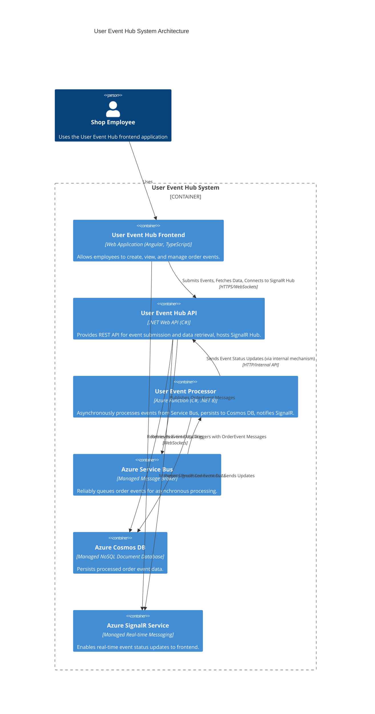

# Components

## User Event Hub Frontend

**Responsibility:** Provides the user interface for shop employees to create, view, and manage user events. It handles user interaction, data presentation, and communicates with the User Event Hub API.

**Key Interfaces:**
-   **User Interface:** Web-based forms and displays for event submission and viewing.
-   **User Event Hub API:** Communicates with the backend API to submit new events and fetch event lists.
-   **SignalR Service:** Establishes a real-time connection to receive live updates on event status.

**Dependencies:**
-   User Event Hub API
-   SignalR Service
-   Azure Active Directory B2C (for authentication)

**Technology Stack:** Angular 21.x (LTS), TypeScript 5.4, Angular Material 18.0, NgRx 21.x, Tailwind CSS 4.1.18, Node.js 22.x (LTS) for development tooling.

## User Event Hub API

**Responsibility:** Provides a secure and robust API endpoint for receiving and validating user event submissions from the frontend. It acts as the gateway to the event processing pipeline, publishing validated events to the Azure Service Bus for asynchronous processing and serving event data from the database to the frontend for display. It also hosts the SignalR Hub for real-time updates.

**Key Interfaces:**
-   **REST API Endpoint (`POST /events/order`):** Receives `OrderEventRequest` from the frontend, performs validation (FR4), and publishes to Azure Service Bus (FR5).
-   **REST API Endpoint (`GET /events/order`):** Retrieves stored `OrderEvent` data from the database for listing/display on the frontend (FR8, Story 1.6).
-   **Azure Service Bus:** Publishes validated `OrderEvent` messages to a dedicated queue.
-   **Azure Cosmos DB:** Connects to the database to store and retrieve `OrderEvent` data.
-   **SignalR Hub:** Provides a real-time communication channel with the frontend for pushing event status updates (Story 2.3).

**Dependencies:**
-   User Event Hub Frontend (consumes its API and SignalR Hub)
-   Azure Service Bus (publishes messages to it)
-   Azure Cosmos DB (reads from and writes to it indirectly via processing function)
-   Azure Active Directory B2C (for authenticating API requests)
-   SignalR Service (hosts the SignalR Hub)

**Technology Stack:** .NET Web API 8.x (LTS), C# 12.x, Azure Active Directory B2C, SignalR.

## User Event Processor

**Responsibility:** Asynchronously processes `OrderEvent` messages received from the Azure Service Bus queue. It performs any necessary business logic, transformations, or enrichments on the event data, and then securely persists the processed information into the chosen database. Finally, it notifies the SignalR Hub of the event's new status for real-time frontend updates.

**Key Interfaces:**
-   **Azure Service Bus Queue Trigger:** Automatically activates upon receiving a new `OrderEvent` message from the dedicated queue.
-   **Azure Cosmos DB:** Executes database operations to write the processed `OrderEvent` data.
-   **SignalR Service Client:** Sends messages to the SignalR Hub (hosted by the User Event Hub API) to trigger real-time updates for connected clients.

**Dependencies:**
-   Azure Service Bus (receives messages from)
-   Azure Cosmos DB (writes data to)
-   SignalR Service (sends notifications to)

**Technology Stack:** Azure Function (running on .NET 8.x LTS, C# 12.x).

## Azure Service Bus

**Responsibility:** Serves as the robust, scalable, and secure message broker for the User Event Hub system. Its primary role is to reliably queue `OrderEvent` messages, decoupling the event-producing User Event Hub API from the event-consuming User Event Processor (Azure Function). This architecture ensures message delivery guarantees, supports asynchronous processing, and enhances system resilience.

**Key Interfaces:**
-   **Receives `OrderEvent` messages:** From the User Event Hub API, which publishes events to a dedicated queue.
-   **Delivers `OrderEvent` messages:** To the User Event Processor, which is triggered upon new message arrival in the queue.

**Dependencies:**
-   User Event Hub API (publishes messages to the Service Bus)
-   User Event Processor (consumes messages from the Service Bus)

**Technology Stack:** Azure Service Bus (Managed Service).

## Azure Cosmos DB

**Responsibility:** Serves as the primary, durable data store for all processed `OrderEvent` records within the User Event Hub. It ensures the reliable persistence, retrieval, and querying of event data, acting as the ultimate source of truth.

**Key Interfaces:**
-   **Receives `OrderEvent` data:** From the User Event Processor (Azure Function) for secure and persistent storage.
-   **Provides `OrderEvent` data:** To the User Event Hub API for efficient retrieval, filtering, and sorting, enabling display in the frontend.

**Dependencies:**
-   User Event Processor (writes processed event data to the database)
-   User Event Hub API (reads event data from the database)

**Technology Stack:** Azure Cosmos DB (Managed Service).

## Azure SignalR Service

**Responsibility:** Facilitates real-time, bidirectional communication between the backend (User Event Hub API, which hosts the SignalR Hub) and the connected frontend clients (User Event Hub Frontend). It enables immediate pushing of event status updates to users without requiring them to manually refresh their pages or for the frontend to constantly poll the API.

**Key Interfaces:**
-   **Receives notifications/messages:** From the User Event Processor (after an event has been processed and persisted) and forwards these to the SignalR Hub.
-   **Delivers real-time updates:** To all connected User Event Hub Frontend instances or specific clients/groups, informing them of new or updated `OrderEvent` statuses.

**Dependencies:**
-   User Event Hub API (hosts the SignalR Hub and manages client connections)
-   User Event Processor (sends event update notifications to the API's SignalR Hub)
-   User Event Hub Frontend (establishes and maintains a persistent connection to the SignalR Hub)

**Technology Stack:** Azure SignalR Service (Managed Service).

## Component Diagrams

