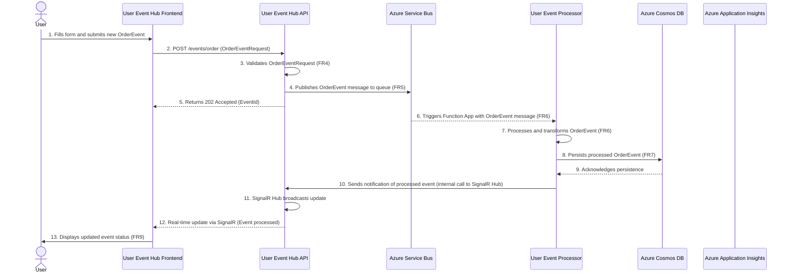

# Core Workflows

## Core Workflows

```mermaid
sequenceDiagram
    actor User
    participant Frontend as User Event Hub Frontend
    participant API as User Event Hub API
    participant ServiceBus as Azure Service Bus
    participant Function as User Event Processor
    participant CosmosDB as Azure Cosmos DB
    participant Telemetry as Azure Application Insights

    User->>Frontend: 1. Fills form and submits new OrderEvent
    Frontend->>API: 2. POST /events/order (OrderEventRequest)
    API->>API: 3. Validates OrderEventRequest (FR4)
    API->>ServiceBus: 4. Publishes OrderEvent message to queue (FR5)
    API-->>Frontend: 5. Returns 202 Accepted (EventId)

    ServiceBus-->>Function: 6. Triggers Function App with OrderEvent message (FR6)
    Function->>Function: 7. Processes and transforms OrderEvent (FR6)
    Function->>CosmosDB: 8. Persists processed OrderEvent (FR7)
    CosmosDB-->>Function: 9. Acknowledges persistence
    Function->>API: 10. Sends notification of processed event (internal call to SignalR Hub)
    API->>API: 11. SignalR Hub broadcasts update
    API-->>Frontend: 12. Real-time update via SignalR (Event processed)
    Frontend->>User: 13. Displays updated event status (FR9)
```
