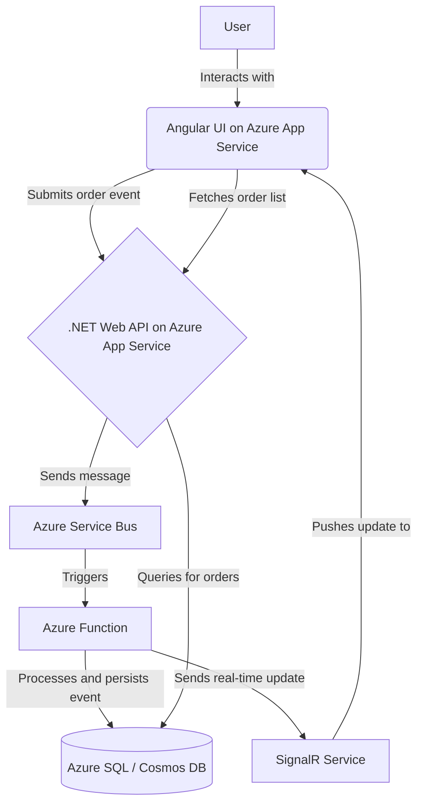

# High Level Architecture

## Technical Summary

The proposed architecture for the User Event Hub is a modern, scalable, and resilient system designed for the cloud. It features a decoupled, microservices-oriented approach that separates the frontend and backend concerns. The frontend will be a responsive Angular single-page application (SPA). The backend will be composed of a .NET Web API for receiving events and an Azure Function for asynchronous processing of those events, with Azure Service Bus acting as the intermediary message queue. This architecture directly supports the goals outlined in the PRD by providing a robust and reliable event processing pipeline. The database choice between Azure SQL and Cosmos DB will be finalized based on a deeper analysis of query patterns and scalability needs.

## Platform and Infrastructure Choice

**Platform:** Microsoft Azure
**Key Services:** Azure App Services (for API and UI), Azure Functions, Azure Service Bus, Azure Cosmos DB, Azure Monitor, and SignalR for real-time updates.
**Deployment Host and Regions:** To be determined, but will likely be a primary region with a secondary region for disaster recovery.

## Repository Structure

**Structure:** Monorepo
**Monorepo Tool:** Nx (due to its excellent support for both Angular and .NET applications within a single repository)
**Package Organization:** The monorepo will be organized into `apps` (for the Angular UI, .NET API, and Azure Function) and `libs` (for shared code, such as data models/types).

## High Level Architecture Diagram

## Architectural Patterns

-   **Serverless Computing:** Leveraging Azure Functions for event processing allows for a scalable, cost-effective, and event-driven backend. - _Rationale:_ Optimal performance and scalability for content-heavy applications
-   **Microservices Architecture:** The system is composed of small, independent services (UI, API, Function) that communicate over well-defined APIs and messages, allowing for independent development, deployment, and scaling. - _Rationale:_ Maintainability and type safety across large codebases
-   **Component-Based UI:** The Angular frontend will be built using reusable components, promoting modularity and maintainability. - _Rationale:_ Enables testing and future database migration flexibility
-   **Asynchronous Messaging:** Using Azure Service Bus to decouple the API from the processing logic enhances reliability and resilience. If the processing service is down, events are safely queued and will be processed when the service recovers. - _Rationale:_ Centralized auth, rate limiting, and monitoring
-   **API Gateway (Implicit):** The .NET Web API acts as a gateway for the frontend to interact with the backend system, providing a single entry point for event submission. - _Rationale:_ 
